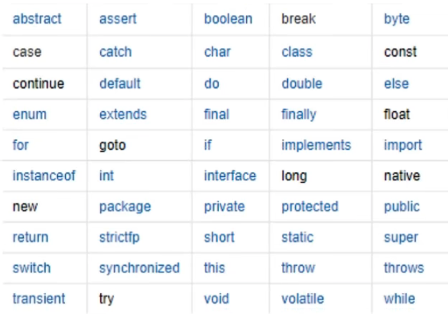

# JAVA SE基础知识整理

> **这是在2022年2月的春招进行的快速整理**


## 1. Java程序运行机制

### 解释型

**执行前全部翻译**

操作系统 C C++ => 效率高


### 解释型

**边执行边解释**

网页 服务器脚本 => 速度要求不高 


### **程序运行机制**


---


## 2. 关键字&标识符



**所有的变量名字：A-Z或者a-z/ <u>$美元符</u> / <u>_下划线</u>**


## 3. 数据类型

**强类型语言**：安全性高，速度就会慢。所有变量必须先定义才能使用；

```java
public class Demo1 {
    public static void main(String[] args) {

        //整数拓展：十进制  八进制  16进制
        int i = 10;
        int i8 = 010;
        int i16 = 0x10;
        System.out.println(i); //10
        System.out.println(i8); //8
        System.out.println(i16); //16

        // Example 1
        float f = 0.1f;
        double d = 0.1;
        System.out.println(f == d);
        System.out.println(f);
        System.out.println(d);
        /** Output:
         * false
         *  0.1
         *  0.1
         */

        // Example 2
        float f1 = 1232323232f;
        float f2 = f1 + 1;
        System.out.println(f1 == f2);
        System.out.println(f1);
        System.out.println(f2);
        /** Output:
         *  true
         *  1.2323232E9
         *  1.2323232E9
         */

        // 总结：浮点数 float 有限的 离散的 舍入误差  大约
    }
}
```

## 4. 重载和重写

重写：方法的重写

重载：方法名相同+参数类型或者数量不同

## 5. static关键字

可以用来修饰**静态变量、静态方法、静态代码块**。

**用途**：方便在没有创建对象的情况下进行方法/变量的调用。

**==关键点==**

- ==**static修饰**==的成员变量和方法，属于类！类！类！
- **==普通==变量和方法，属于对象！对象！对象！**
- **==静态方法不能调用非静态成员和方法==，编译会报错！！！因为非静态内容还没加载进来呢！！！**


**静态变量**：在类加载的时候就跟着一起加载了，**只会加载一次**，**生命周期和类是相同的**。且多个实例共享一个类静态变量。

**==静态变量一般用类名来直接获取==**

```java
package Student;

public class Student {

    private static int age;
    private String name;
  
    public static void main(String[] args) {
      System.out.println(Student.age);
    }
  
}
```

**静态方法**：由于静态方法不依赖于任何对象就可以直接访问，因此对于静态方法来说，是没有this的。

**静态块**：用于类的初始化操作。在构造方法之前执行。


## 6. final关键字

**==一般用来修饰变量==**

- **final类**不能被继承，没有子类，final类中的方法默认是final的。
- **final方法**不能被子类的方法覆盖，但可以被继承。
- **final成员变量**表示常量，只能被赋值一次，赋值后值不再改变。
- final不能用于修饰构造方法。


- **final修饰==变量==：**在**==定义==**时或者==**构造器**==中进行初始化赋值。一旦初始化不能再被赋值。

```java
public class Test {
    public static void main(String[] args)  {
        String a = "hello2"; //直接在缓冲区放入“hello2”并让a指向它
        final String b = "hello"; 
        String d = "hello";
        String c = b + 2; // 直接去缓冲区找到“hello2”的地址并赋值给c
        String e = d + 2;
        System.out.println((a == c)); //因此 a和c指向的地址 true
        System.out.println((a == e)); //false
    }
}
```


- **修饰==引用对象==。不能改变引用的对象地址，但该地址的对象是可以变化的**

   

```java
public class FinalTest {
    public static void main(String[] args) {
        final Student student = new Student("zhangsan");
        System.out.println(student.toString()); // 输出：Student{name='zhangsan'}
        student.setName("lisi");
        System.out.println(student.toString()); // 输出：Student{name='lisi'}
    }
}

class Student {
    private String name;

    public Student(String name) {
        this.name = name;
    }

    public void setName(String name) {
        this.name = name;
    }

    @Override
    public String toString() {
        return "Student{" +
                "name='" + name + '\'' +
                '}';
    }
}
```


- **修饰==类成员变量==**。不能保证多个对象的值都是同一个

```java
package FinalTest;

public class FinalTest {
    public static void main(String[] args) {
        MyClass myClass1 = new MyClass();
        MyClass myClass2 = new MyClass();

        System.out.println("【final】myClass1.i = " + myClass1.i);
        System.out.println("【static】myClass1.j = " + myClass1.j);
        System.out.println("【final】myClass2.i = " + myClass2.i);
        System.out.println("【static】myClass2.j = " + myClass2.j);
        
        /* Output：
          【final】myClass1.i = 0.7612592357012237
          【static】myClass1.j = 0.017339634766212586
          【final】myClass2.i = 0.5057989852849457
          【static】myClass2.j = 0.017339634766212586
         */
    }
}

class MyClass {

    public static double j = Math.random();
    public final double i = Math.random();
}
```


## 7. 抽象类和接口

### 抽象类

**==模板设计模式==**

**==是普通类里多了抽象方法！==**

**public/protected 抽象方法**：一个没有实现的方法！没有方法体！

1. 一定是**==public/protected==**，为了继承！！！
2. **==不能直接实例化==**；
3. 一定要用子类，只能子类**==只能继承一个==**抽象类！ **解释：一定要有儿子，但是儿子只能有一个亲爹**
4. 子类**==必须覆写==**抽象类中的**==全部抽象方法==**！！！


### 接口

**==工厂模式==**

1. **==接口可以继承接口==**
2. **==不能直接实例化==**
3. 一个类可以**==实现多接口==**
4. 实现某个接口，需要**==实现==**接口的**==所有方法==**
5. 接口方法都是**==public static final==**
6. 弥补无法实现多继承的局限


> **接口中的default修饰符**

java8以后，接口可以被default或者static修饰。**default修饰方法只能在接口中使用**，在接口中被default标记的方法为**普通方法**，可以直接**写方法体**。

- 一个类实现了==1个接口==，可以直接调用对应default方法；
- 一个类实现了==2个有相同方法的接口==，需要重写方法；
- 一个类实现了==1个接口和继承了1个父类(接口和父类有相同方法)==，调用父类方法。类>接口


> **使用场景**

1. 如果拥有一些方法并且想让它们中的一些**==有默认实现==**，那么**==使用抽象类==**吧。 
2. 如果想**==实现多重继承==**，那么必须**==使用接口==**。由于Java不支持多继承，即一个类只能有一个超类。但是，可以实现多个接口，因此可以使用接口来解决它。 
3. 如果基**==本功能在不断改变==**，那么就需要**==使用抽象类==**，达到解耦目的。如果不断改变基本功能并且使用接口，那么就需要改变所有实现了该接口的类。


## 8. 生成javadoc文档

```bash
javadoc -encoding UTF-8 -charset UTF-8 *.java
```


## 9.可变长参数…必须放在最后一个


## 10.Object类

- hashcode()
- toString()
- Clone()
- getClass()
- Notify()
- wait()
- equals()

## 11. 异常类 Exception

### Exception体系


> 图片来源狂神说的视频，跳转网址https://www.bilibili.com/video/BV12J41137hu?p=79

#### 实际工作中的Exception总结


> 图片来源狂神说的视频，跳转网址https://www.bilibili.com/video/BV12J41137hu?p=79

----


### Finally相关

> **参考文章：[CSDN-finally块啥时候执行](https://blog.csdn.net/dove_knowledge/article/details/71077512)**

#### 异常下如何优雅的关闭资源？

jdk7中新增的`Try-with-resource`语法：对于外部资源句柄对象，例如（FileInputStream对象）**==实现了AutoCloseable接口==**。

**原来的写法**

```java
public static void main(String[] args) {
    FileInputStream inputStream = null;
    try {
        inputStream = new FileInputStream(new File("test"));
        System.out.println(inputStream.read());
    } catch (IOException e) {
        throw new RuntimeException(e.getMessage(), e);
    } finally {
        if (inputStream != null) {
            try {
                inputStream.close();
            } catch (IOException e) {
                throw new RuntimeException(e.getMessage(), e);
            }
        }
    }
}
```

**现在的写法**

```java
public static void main(String[] args) {
    try (FileInputStream inputStream = new FileInputStream(new File("test"))) {
        System.out.println(inputStream.read());
    } catch (IOException e) {
        throw new RuntimeException(e.getMessage(), e);
    }
}
```

**总结：将外部资源句柄对象的创建，放到try()中，当try/catch执行完毕后，会确保这类对象被close方法调用**

> **拓展：异常抑制**

反编译后，会看到代码有一段var2.addSuppressed(var11)。

当对外部资源**进行处理（读或者写）时，遭遇异常**，且在**关闭**外部资源的过程中**再次遭遇异常**，那么我们**catch到的是对外部资源进行处理时候遭遇的异常**，关闭资源遭遇的异常会被"抑制"，注意不是丢弃，通过`getSuppressed`可以提取被抑制的异常。

#### **finally一定会执行吗？**

不一定。如果***在try之前就报错***`int 1/0; try{};finally{}`或者***在try块中强行退出***`System.exit(0)`。

#### **finally块啥时候执行？**

- 在**==return之前==**执行
- 当try-finally或者catch-finally***都有return***的时候，***==finally的return会覆盖前面的任何return==***
- **==finally中修改基本数据类型，不影响结果；修改引用数据类型，影响结果。==**

```java
public class TestFinally {

    public static void main(String[] args) {
        System.out.println("Finally有return值：");
        System.out.println(testfinally());
        System.out.println("基本数据类型：");
        System.out.println(testfinally1());
        System.out.println("引用数据类型：");
        System.out.println(testfinally2());
    }

    /**
     * 对于引用数据类型 finally对值的改变，影响结果！
     * @return
     */
    public static StringBuilder testfinally2() {
        StringBuilder sb = new StringBuilder("hello");
        try {
            System.out.println("try");
            return sb;
        } catch (Exception e) {
            System.out.println("catch");
            return sb;
        } finally {
            // 引用传递，会影响返回值
            sb.append(" world");
            System.out.println("finally");
        }
    }

    /**
     * 对于基本的数据类型 finally对值的改变，不影响结果
     * @return
     */
    public static int testfinally1() {
        int a = 0;
        try {
            a = 1;
            System.out.println("try");
            return a;
        } catch (Exception e) {
            a = 2;
            System.out.println("catch");
            return a;
        } finally {
            // 值传递，不会影响a的返回值
            a = 3;
            System.out.println("finally");
        }
    }

    /**
     * 如果finally有return，会覆盖其他的值
     * @return
     */
    public static int testfinally() {
        try {
            System.out.println("try");
            return 1;
        } catch (Exception e) {
            System.out.println("catch");
            return 2;
        } finally {
            System.out.println("finally");
            return 3;
        }
    }
}
```

 


## 12. 包装类

**==自动装箱和拆箱==**

**用途**：

1. 集合不允许存放基本数据类型
2. 包含了基本数据类型的相关属性，例如最大值、最小值；
3. 提供了一系列的对象操作

**考点**：

**1、包装类中“==”与equals的用法比较**

值得注意的是，包装类中的equals方法和String类一样，都是重写了Object类中的equals方法，因此**==比较的是内容而不是地址==**，

而**'\=\='==比较的依然是引用变量的地址==**，只是当包装类型和与之相对应的基本类型进行比较时会**==先做自动拆箱处理==**。

**2、包装类缓存**

**部分包装类提供了对象的缓存**，实现方式是在类初始化时提前创建好会频繁使用的包装类对象，当需要使用某个包装类的对象时，如果该对象包装的值在缓存的范围内，就返回缓存的对象，否则就创建新的对象并返回。

```java
public class IntegerTest {
  
    public static void main(String[] args) {
        Integer a1 = new Integer(127);
        Integer a2 = new Integer(127);
        System.out.println(a1 == a2);
        System.out.println(a1.equals(a2));
        System.out.println();

        Integer b1 = new Integer(128);
        Integer b2 = new Integer(128);
        System.out.println(b1 == b2);
        System.out.println(b1.equals(b2));
        System.out.println();

        Integer c1 = 128;
        Integer c2 = 128;
        System.out.println(c1 == c2);
        System.out.println(c1.equals(c2));
        System.out.println();

        Integer d1 = 127;
        Integer d2 = 127;
        System.out.println(d1 == d2);
        System.out.println(d1.equals(d2));
    }
}

//Output
false
true

false
true

false
true

true
true
```

## 13. IO流

 


## 14.集合类（容器）

 

Map-->HashMap 

### HashSet

**参考资料:[HashSet底层原理](https://www.cnblogs.com/nineberg/p/13692174.html#:~:text=%E5%AE%9E%E7%8E%B0%E5%8E%9F%E7%90%86,hashset%E6%98%AF%E5%9F%BA%E4%BA%8Ehashmap%E5%AE%9E%E7%8E%B0%E7%9A%84%EF%BC%8C%E9%BB%98%E8%AE%A4%E6%9E%84%E9%80%A0%E5%87%BD%E6%95%B0%E6%98%AF%E6%9E%84%E5%BB%BA%E4%B8%80%E4%B8%AA%E5%88%9D%E5%A7%8B%E5%AE%B9%E9%87%8F%E4%B8%BA16%EF%BC%8C%E8%B4%9F%E8%BD%BD%E5%9B%A0%E5%AD%90%E4%B8%BA0.75%E7%9A%84hashmap%E3%80%82)**

**原理：**hashset是**基于hashmap实现的**，默认构造函数是构建一个初始容量为16，负载因子为0.75的hashmap。封装了一个hashmap 对象来存储所有的集合元素，所有放在 hashset中的**集合元素实际上由 hashmap的key来保存**，而 hashset中的 hashmap的 **value则存储了一个PRESENT的静态object对象。**

如果**元素不存在**（判断HashMap的key不存在），就加入；**存在元素**（判断HashMap的key存在），就不会加入返回false；


### HashMap

#### put()原理


#### 为什么桶里的数据量大于8才转红黑树？

[参考文章](https://zhuanlan.zhihu.com/p/263523069)

> **==不一定，前言：如果桶数量小于64，先扩容==**

因为如果先树化，再扩容，操作树节点的移动比链表复杂的多。

到64再树化，基本很难会有冲突了，就算有，说明数量已经很大了，代价也是可以接受的。

- 由于treeify过程，需要把Node对象转换成TreeNode对象，**TreeNode对象大小是Node的两倍。**

- 同时，treeify过程耗时间。当桶中数据量**小于等于6时候，又转换回List；**
- 因此，找到一个阈值k，可以**==避免红黑树频繁转换==**，**==同时不能太大，影响了插入和查找效率==**！

> 因此，我们的问题：**==计算 P(一个桶里出现k个KV pair的概率)==**

- 假设table的长度是m，m个桶🪣，每个KV pair落入每个桶的概率相等，求不同的k对应的概率
- 其实就是**==泊松分布问题==**

 

那最终，源码也给出了P(k=8)<千万分之六。超过8的概率，小于千万分之一。

> X = 0: P = 0.60653066
>
> X = 1: P = 0.30326533
>
> X = 2: P = 0.07581633
>
> X = 3: P = 0.01263606
>
> X = 4: P = 0.00157952
>
> X = 5: P = 0.00015795
>
> X = 6: P = 0.00001316
>
> X = 7: P = 0.00000094
>
> X = 8: P = 0.00000006
>
> X > 8: P less than 1 in ten million