# Redis

> 此文章的学习是跟随**==B站狂神说的Redis教学系列视频==**进行学习的，具体教学视频请访问此B站链接！
>
> https://www.bilibili.com/video/BV1S54y1R7SB?p=36&spm_id_from=pageDriver
>
> 侵删！

## 1. NoSQL概述
### 为什么要使用NoSQL？

> 1、单机MySQL的年代！

90年代 html，服务器没太大压力，单机数据库足够了！


==**网站的瓶颈是什么**？==

1. **数据量太大**，一个机器放不下。
2. **数据的索引**（B+ Tree），一个机器**内存也放不下**。
3. **访问量（读写混合）**，一个**服务器承受不了**。

**如果出现以上1项，需要upgrade！**

----

> 2、Memcached（缓存）+MySQL+垂直拆分（读写分离）

发展过程：优化数据结构和索引-->文件缓存（IO）不能共享/操作重量大-->==**Memcached（当时最热门的技术！）**== **<u>缓存+读写分离</u>**

**因为网站80%是在读，用Cache！==目的：解决了读压力==！**

 

> 3、分库分表 + 水平拆分 + MySQL集群

==**<u>升级的本质：解决数据库（读、写）</u>**==

早些年 MyISAM：表锁！（100万 假设要查张3密码 本来应该锁一行，结果锁了表） 高并发下会出现严重的锁问题

现在Innodb：行锁！

**==Gradually，使用分库分表！目的：解决写压力！==**

> 4、最近的年代

技术爆炸：定位，音乐，热榜

MySQL等关系型数据库不够用了！数据量很多，变化很快～

图形数据库/JSON/BSON

MySQL存储比较大博客/图片 ，导致效率很低，**希望有个数据库能专门处理这种数据。**

> 目前的互联网项目

 


> **为什么要用NoSQL？！**

用户的个人信息，社交网络，地理位置，用户自己产生的数据，用户的日志等爆发增长！！！

**这个时候就需要使用NoSQL数据库，可以很好的处理以上的情况！**

----

### 什么是NoSQL？

关系型数据库：表格，行，列

很多数据类型，不需要一个固定的格式，横向扩展！ Map<String,Object> 使用键值对

> NoSQL特点

**==解耦！==**

1. **方便扩展**（数据之间没有关系）
2. **大数据量高性能（Redis 写8w/s 读11w/s，**NoSQL的缓存记录级，是一种细粒度的缓存，性能比较高）
3. 数据类型多样性！**（不需要事先设计数据库！随取随用！）**
4. **RDBMS vs NoSQL**

```
传统的RDBMS
- 结构化组织
- SQL
- 数据和关系都存在单独的表中 row col
- 数据定义语言DDL、数据操作语言DML
- 严格一致性
- 基础的事务
......
```

```
NoSQL
- 不仅仅是数据
- 没有固定的查询语言
- 4大分类：键值对存储/ 列存储/ 文档存储/ 图形数据库（社交关系）
- 最终一致性
- CAP定理和BASE
- 高性能、高可用、高可扩
......
```

  **王道：一起使用！SQL+NoSQL**

----

大型互联网应用问题：

- 数据类型太多了
- 数据源繁多，经常重构！
- 数据要改造，大面积改造！

解决办法：

​	**统一数据服务层UDSL**

==**热点缓存架构**==


### NoSQL的四大分类

**KV键值对：**

- 新浪：redis
- 美团：redis+Tair
- 阿里、百度：Redis+memecache

**文档型据库（bson格式和json一样）：**

- **MongoDB**（一定要掌握）
  - <u>基于分布式文件存储的数据库</u>，C++编写的。主要用来处理大量的文档！
  - MongoDB是一个介于关系型数据库和非关系型数据库中的中间产品！ <u>MongoDB是非关系型数据库中，功能最丰富，最像关系型数据库的！</u>
  - ConthDB

**列存储**：

- HBase
- 分布式文件系统

**图形关系数据库：**

- 存的关系：朋友圈/ 广告推荐！
- **Neo4j** 

----

## 2. Redis 入门

> Redis是什么？

**Redis(==Re==mote ==Dic==tionary ==Ser==ver)** , 远程字典服务！

Redis 会**==周期性==**的把更新的数据==**写入磁盘**==或者把**==修改操作写入追加的记录文件==**，并且在此基础上实现master-slave主从同步。

> Redis能干嘛？

1. 内存存储，持久化：（rdb aof）

2. 效率高，用于高速缓存
3. 发布订阅系统
4. 地图信息分析
5. 计时器、计数器（浏览量！）
6. ……

> 特性

1. 多样的数据类型
2. 持久化
3. 集群
4. 事务

……

> 学习中需要用到的东西

1. redis.io
2. redis.cn
3. 下载地址：官网下载

### Redis安装

> mac下载

1. 终端使用`brew install redis` 即可

2. 先启动服务端`redis-server redis.conf`  **default port:6379**

3. 启动客户端连接`redis-cli ~~-h 127.0.0.1~~ -p 6379  **default: -h localhost**


4. 运行`ps -ef | grep redis` 查看redis进程


5. 退出redis `shutdown`   -->   `exit` 

   

6. 查看redis进程，server和client端都关闭

---

### 测试性能Redis benchmark

redis benchmark是一个压力测试工具！官方自带！

redis目录下执行，去运行对应的可执行文件。


----

### 基础知识

Redis **默认有16个数据库，默认使用的是第0个，可以使用select进行切换数据库。**

`select` #切换数据库

`keys [pattern] e.g.keys *` #查看所有的keys

```bash
127.0.0.1:6379> select 2
OK
127.0.0.1:6379[2]> keys *
(empty array)
```

`dbsize` #查看db大小

```bash
127.0.0.1:6379> dbsize
(integer) 0
127.0.0.1:6379> set name 111
OK
127.0.0.1:6379> dbsize
(integer) 1
```

清除当前数据库 `flushdb`

清除全部数据库的内容 `flushall`

> **==Redis是单线程的！==**

Redis是基于内存操作的，CPU不是Redis性能瓶颈，Redis的瓶颈是根据机器的内存和网络带宽，既然可以使用单线程来实现，就是用单线程了！

Redis是C语言写的，官方提供的数据为：**QPS 10W+/s** ，完全不比同样KV的Memcached差。

**Redis为什么单线程还那么快？**

1. 误区1：高性能的服务器一定是多线程的吗？
2. 误区2：多线程（CPU上下文切换消耗！）一定比单线程效率高吗？

首先**CPU>内存>硬盘的速度**要有所了解！

**==核心：==**redis将**所有的数据全部放在内存中**，所以使用单线程去操作效率是最高的，**多线程（CPU上下文切换：耗时操作！！！）**，对于内存系统来说，如果没有上下文切换，效率就是最高的！多次读写都是在一个CPU上的，在内存情况下，这个就是最佳的方案！

----

## 3. 五大数据类型

> 官方文档：可以用作**==数据库、缓存、消息中间件MQ==**

### Redis-Key

`keys *` 查看所有的key

`set name tao` 设置key

`EXISTS name` 判断当前key是否存在 

`move name 1`  移除当前的key （一般不这样用）

`EXPIRE name 10` 设置过期时间（单位：seconds）

`ttl name` 查看当前key的剩余时间

`type name` 查看当前key的类型

### String字符串

`APPEND` name "ye"追加字符串，如果没有就创建，有就追加

`STRLEN` name 获取字符串长度

```bash
127.0.0.1:6379> keys *
(empty array)
127.0.0.1:6379> append name zhangsan #追加字符串，如果没有就创建
(integer) 8
127.0.0.1:6379> keys *
1) "name"
127.0.0.1:6379> get name
"zhangsan"
127.0.0.1:6379> append name :shigou #追加字符串，如果有就追加
(integer) 15
127.0.0.1:6379> get name
"zhangsan:shigou"
127.0.0.1:6379> get key
"mongodbno1"
127.0.0.1:6379> strlen name #获取字符串长度
(integer) 15
```

##################

`set` views 0 设置初始浏览量为0

`incr` views 自增1 浏览量+1

`decr` views 自减1 浏览量-1

`INCRBY` views 10 可以设置步长，指定增量

`DECRBY` views 5 可以设置步长，指定减量

```bash
127.0.0.1:6379> set views 0 #设置初始浏览量为0
OK 
127.0.0.1:6379> incr views #自增1 浏览量+1
(integer) 1
127.0.0.1:6379> incr views
(integer) 2
127.0.0.1:6379> decr views #自减1 浏览量-1
(integer) 1
127.0.0.1:6379> decr views
(integer) 0
127.0.0.1:6379> INCRBY views 10 #可以设置步长，指定增量
(integer) 10
127.0.0.1:6379> INCRBY views 10
(integer) 20
127.0.0.1:6379> DECRBY views 5 #可以设置步长，指定减量
(integer) 15
127.0.0.1:6379> DECRBY views 5
(integer) 10
```

##############################

`GETRANGE` name `0 3` 截取字符串[0,3]

`GETRANGE` name 0 -1 截取全部字符串

```bash
127.0.0.1:6379> getrange name 0 3 #截取字符串[0,3]
"mogo"
127.0.0.1:6379> getrange name 0 -1 # 截取全部字符串,-1从右往左
"mogodbno1"
```

##############################

`SETRANGE` name `1` `xxxx`替换 指定位置(包括该位置）开始的字符串

```bash
127.0.0.1:6379> set name taoye
OK
127.0.0.1:6379> get name
"taoye"
127.0.0.1:6379> setrange name 3 xx
(integer) 6
127.0.0.1:6379> get name
"taoxx"
```

##############################

`setex (set with expire)`

`setnx (set if not exist)` 

```bash
127.0.0.1:6379> setex key 30 "tao" #设置字符串过期时间
OK
127.0.0.1:6379> ttl key #查看剩余时间（s）
(integer) 28
127.0.0.1:6379> keys *
1) "key"
127.0.0.1:6379> setnx key2 "beibei" #设置字符串，如果不存在则创建，如果存在则创建失败！
(integer) 1
127.0.0.1:6379> get key2
"beibei"
127.0.0.1:6379> setnx key2 "hanhan" # key2存在，则创建失败
(integer) 0
127.0.0.1:6379> get key2
"beibei"
127.0.0.1:6379> get key # 30s后key已经过期
(nil)
```

##############################

`mset k1 v1 k2 v2 k3 v3` 同时设置多个值

`mget k1 k2 k3 `同时获取多个值

`msetnx k1 v1 k4 v4` 原子性操作，要么一起成功，要么一起失败

```bash
127.0.0.1:6379> mset k1 v1 k2 v2 k3 v3 #同时设置多个值
OK
127.0.0.1:6379> mget k1 k2 k3 #同时获取多个值
1) "v1"
2) "v2"
3) "v3"
127.0.0.1:6379> msetnx k1 v11 k4 v4 #原子性操作，要么一起成功，要么一起失败
(integer) 0
127.0.0.1:6379> get k4
(nil)

##############################
# 保存对象
set user:1 {name:zhangsan,age:15} #设置一个user:1对象，值为json字符串保存一个对象！

# 这里的key是一个巧妙的设计：user:{id}:{field}，如此设计在Redis是完全OK的！

127.0.0.1:6379> mset user:1:name zhangsan user:1:age 15
OK
127.0.0.1:6379> mget user:1:name user:1:age
1) "zhangsan"
2) "15"
```

`getset`  先get再set 返回原值，然后更新为新值

```bash
127.0.0.1:6379> getset key redis #如果不存在值，则返回nil;并设置新值
(nil)
127.0.0.1:6379> get key 
"redis"
127.0.0.1:6379> getset key mongodb #如果存在值，则返回原值;并设置新值
"redis"
127.0.0.1:6379> get key
"mongodb"
```

思考：**==CAS???==** 无论是否key存在或一样，都已经更新了不是吗？


**==String的使用场景==**

value除了是我们的字符串还可以是我们的**数字**！

- **计数器**: 粉丝数/ 点赞数/ 收藏数
- **统计多单位的数值** 
- **对象缓存存储！** 


### List列表

在redis里，可以把list完成 栈、队列、阻塞队列

```bash
127.0.0.1:6379> keys *
(empty array)
127.0.0.1:6379> lpush list one # 头插法加入元素
(integer) 1
127.0.0.1:6379> lpush list two
(integer) 2
127.0.0.1:6379> lpush list three
(integer) 3
127.0.0.1:6379> lrange list 0 -1 # 获取list中的值
1) "three"
2) "two"
3) "one"
127.0.0.1:6379> lrange list 0 1 # 通过具体的区间获取具体的值
1) "three"
2) "two"
###################################################
127.0.0.1:6379> rpush list right # 尾插法加入元素
(integer) 4
127.0.0.1:6379> lrange list 0 -1
1) "three"
2) "two"
3) "one"
4) "right"
###################################################
127.0.0.1:6379> lrange list 0 -1
1) "three"
2) "two"
3) "one"
4) "right"
127.0.0.1:6379> lpop list  # 移除列表的头部元素
"three"
127.0.0.1:6379> rpop list # 移除列表的尾部元素
"right"
127.0.0.1:6379> lrange list 0 -1
1) "two"
2) "one"
127.0.0.1:6379> lindex list 1 # 获取指定位置的list元素
"one"
127.0.0.1:6379> lindex list 0
"two"
127.0.0.1:6379> llen list # get List length
(integer) 2
###################################################
127.0.0.1:6379> lrange list 0 -1
1) "three"
2) "three"
3) "two"
127.0.0.1:6379> lrem list 2 three # remove two 'three'
(integer) 2
127.0.0.1:6379> lrange list 0 -1
1) "two"
###################################################
127.0.0.1:6379> rpush mylist "hello"
(integer) 1
127.0.0.1:6379> rpush mylist "hello1"
(integer) 2
127.0.0.1:6379> rpush mylist "hello2"
(integer) 3
127.0.0.1:6379> rpush mylist "hello3"
(integer) 4
127.0.0.1:6379> ltrim mylist 1 2 # 通过下标截取指定长度，list已经被改变，只剩下截取后的list
OK
127.0.0.1:6379> lrange mylist 0 -1
1) "hello1"
2) "hello2"
###################################################
rpoplpush 移除列表最后一个元素，将它移动到新的List中

127.0.0.1:6379> rpush mylist "hello"
(integer) 1
127.0.0.1:6379> rpush mylist "hello1"
(integer) 2
127.0.0.1:6379> rpush mylist "hello2"
(integer) 3
127.0.0.1:6379> rpoplpush mylist newlist
"hello2"
127.0.0.1:6379> lrange mylist 0 -1 # 
1) "hello"
2) "hello1"
127.0.0.1:6379> lrange newlist 0 -1 #
1) "hello2"
###################################################
lset #将列表中指定下标的值替换为另一个值，update
127.0.0.1:6379> exists list # 判断列表是否存在
(integer) 0
127.0.0.1:6379> lset list 0 item # 如果不存在列表我们去更新就会报错
(error) ERR no such key
127.0.0.1:6379> lpush list value1
(integer) 1
127.0.0.1:6379> lrange list 0 0
1) "value1"
127.0.0.1:6379> lset list 0 item # 如果存在，更新当前下标的值
OK
127.0.0.1:6379> lrange list 0 0
1) "item"
127.0.0.1:6379> lset list 1 other # 如果不存在，则报错！！
(error) ERR index out of range
###################################################
linsert #将某个值加入到list中的某个值的前面或者后面

127.0.0.1:6379> rpush mylist "hello"
(integer) 1
127.0.0.1:6379> rpush mylist "world"
(integer) 2
127.0.0.1:6379> linsert mylist before "world" "other" #
(integer) 3
127.0.0.1:6379> lrange mylist 0 -1
1) "hello"
2) "other"
3) "world"
127.0.0.1:6379> linsert mylist after world "!!!" #
(integer) 4
127.0.0.1:6379> lrange mylist 0 -1
1) "hello"
2) "other"
3) "world"
4) "!!!"
```

> 小结

- 他实际上是一个链表，可以**before or after** node插入值，也可以**left or right**插入值
- 两边Insert Or Update，high productivity；操作中间元素，low productivity；
- **如果key不存在，创建新链表；如果key存在，新增内容**
- 如果**移除了list所有值，空链表=>不存在**

**==使用场景：消息排队！消息队列（lpush，rpop），栈（lpush，lpop）！==**

### Set集合

**set中的值不能重复！！！**

```bash
127.0.0.1:6379> sadd myset "hello" # set 集合添加元素
(integer) 1
127.0.0.1:6379> sadd myset "tao"
(integer) 1
127.0.0.1:6379> sadd myset "bei"
(integer) 1
127.0.0.1:6379> smembers myset # 查看指定set的所有值
1) "hello"
2) "bei"
3) "tao"
127.0.0.1:6379> sismember myset hello # 判断某一个值是否在集合中
(integer) 1
127.0.0.1:6379> sismember myset w
(integer) 0
127.0.0.1:6379> scard myset # 获取set集合中的元素个数！
(integer) 3
127.0.0.1:6379> sadd myset "tao" # 不可添加重复的值
(integer) 0
127.0.0.1:6379> srem myset hello # 移除集合中的元素
(integer) 1
127.0.0.1:6379> scard myset
(integer) 2
127.0.0.1:6379> smembers myset
1) "bei"
2) "tao"
################################################
set # 抽随机！
127.0.0.1:6379> smembers myset
1) "tao1"
2) "tao2"
3) "bei"
4) "tao"
5) "tao3"
127.0.0.1:6379> srandmember myset # 随机抽取一个元素
"tao3"
127.0.0.1:6379> srandmember myset
"tao1"
127.0.0.1:6379> srandmember myset
"tao3"
127.0.0.1:6379> srandmember myset
"tao"
127.0.0.1:6379> srandmember myset 2 # 随机抽取2个元素
1) "tao2"
2) "bei"
127.0.0.1:6379> srandmember myset 2
1) "bei"
2) "tao1"
################################################
删除指定的key，随机删除key！
127.0.0.1:6379> smembers myset
1) "tao2"
2) "tao"
3) "bei"
4) "tao1"
5) "tao3"
127.0.0.1:6379> spop myset # 随机删除一些set集合中的元素！
"tao"
127.0.0.1:6379> smembers myset
1) "tao2"
2) "bei"
3) "tao1"
4) "tao3"
################################################
127.0.0.1:6379> sadd myset "hello"
(integer) 1
127.0.0.1:6379> sadd myset "hello1"
(integer) 1
127.0.0.1:6379> sadd myset "hello2"
(integer) 1
127.0.0.1:6379> sadd myset2 "set2"
(integer) 1
127.0.0.1:6379> smove myset myset2 "hello1" #将一个指定的值移动到另外一个set集合中去！
(integer) 1
127.0.0.1:6379> smembers myset
1) "hello"
2) "hello2"
127.0.0.1:6379> smembers myset2
1) "hello1"
2) "set2"
################################################
微博/ B站/ 共同关注！（并集）
127.0.0.1:6379> sadd key1 a
(integer) 1
127.0.0.1:6379> sadd key1 b
(integer) 1
127.0.0.1:6379> sadd key1 c
(integer) 1
127.0.0.1:6379> sadd key2 b
(integer) 1
127.0.0.1:6379> sadd key2 c
(integer) 1
127.0.0.1:6379> sadd key2 e
(integer) 1
127.0.0.1:6379> smembers key1
1) "c"
2) "b"
3) "a"
127.0.0.1:6379> smembers key2
1) "c"
2) "e"
3) "b"
127.0.0.1:6379> sdiff key1 key2 # 差集
1) "a"
127.0.0.1:6379> sinter key1 key2 # 交集 共同好友
1) "c"
2) "b"
127.0.0.1:6379> sunion key1 key2 # 并集
1) "c"
2) "e"
3) "a"
4) "b"
```

**==使用场景：==**

==微博：A用户将所有关注的人放在一个set集合中！B用户将她的粉丝也放在一个集合中！ A、B的粉丝set的交集，就是**共同关注！**==

==共同给你关注，共同爱好，二度好友，推荐好友！（六度分隔理论）==

### Hash散列

Map集合，key=>map集合！

```shell
127.0.0.1:6379> hset myhash field1 hanghang # hset：设置一个KV对
(integer) 1
127.0.0.1:6379> hget myhash field1 # hget：获取指定Key的value
"hanghang"
127.0.0.1:6379> hmset myhash field1 beibei field2 love # hmset：批量插入KV对
OK
127.0.0.1:6379> hmget myhash field1 field2 # hmget：批量根据key获取value
1) "beibei"
2) "love"
127.0.0.1:6379> hdel myhash field1 # hdel：删除某个KV对
(integer) 1

########################################################################
127.0.0.1:6379> hgetall myhash # hgetall：获取所有的KV对
1) "field2"
2) "love"
3) "field3"
4) "hanghang"
127.0.0.1:6379> hkeys myhash # hkeys：获取所有key
1) "field2"
2) "field3"
127.0.0.1:6379> hvals myhash # hvals：获取所有value
1) "love"
2) "hanghang"
127.0.0.1:6379> hlen myhash # hlen：获取Map的长度
(integer) 2

########################################################################
127.0.0.1:6379> hexists myhash field1 # 判断Map中的指定key是否存在
(integer) 0
127.0.0.1:6379> hexists myhash field2
(integer) 1
 
########################################################################
127.0.0.1:6379> hset myhash field4 5 
(integer) 1
127.0.0.1:6379> hincrby myhash field4 1 # hincrby:指定增量/减量
(integer) 6
127.0.0.1:6379> hincrby myhash field4 2
(integer) 8
127.0.0.1:6379> hincrby myhash field4 -1
(integer) 7
127.0.0.1:6379> hget myhash field4
"7"
127.0.0.1:6379> hsetnx myhash field4 lock # hsetnx:如果存在则不能设置
(integer) 0
127.0.0.1:6379> hsetnx myhash field5 lock # hsetnx:如果不存在则设置
(integer) 1
```

==**应用场景：存储用户信息之类，经常变动的信息！hash更适合对象的存储，String更适合字符串存储！**==

```shell
# 场景模拟
127.0.0.1:6379> hset user:1 name hanghang
(integer) 1
127.0.0.1:6379> hset user:1 age 18
(integer) 1
127.0.0.1:6379> hset user:2 name beibei
(integer) 1
127.0.0.1:6379> hset user:2 age 3
(integer) 1
127.0.0.1:6379> hgetall user:1
1) "name"
2) "hanghang"
3) "age"
4) "18
127.0.0.1:6379> hget user:1 name
"hanghang"
```

### Zset(sorted sets)有序集合

```shell
127.0.0.1:6379> zadd myset 1 one # zadd：添加集合元素
(integer) 1
127.0.0.1:6379> zadd myset 2 two 3 three # zadd：添加集合元素
(integer) 2
127.0.0.1:6379> zrange myset 0 -1 # zrange：遍历集合
1) "one"
2) "two"
3) "three"

##############################################################
# 排序如何实现
127.0.0.1:6379> zadd salary 2500 xiaohong # 插入3个工人和薪资
(integer) 1
127.0.0.1:6379> zadd salary 5000 zhangsan
(integer) 1
127.0.0.1:6379> zadd salary 500 hanghang
(integer) 1
# ZRANGEBYSCORE key min max [withscores]
127.0.0.1:6379> zrangebyscore salary -inf +inf # 显示全部的用户 升序 从小到大！
1) "hanghang"
2) "xiaohong"
3) "zhangsan"
127.0.0.1:6379> zrevrange salary 0 -1 # 从大到小进行排序！
1) "zhangsan"
2) "xiaohong"
3) "hanghang"
127.0.0.1:6379> zrangebyscore salary -inf +inf withscores # 显示全部的用户并且附带成绩(薪水) 升序 从小到大！
1) "hanghang"
2) "500"
3) "xiaohong"
4) "2500"
5) "zhangsan"
6) "5000"
127.0.0.1:6379> zrangebyscore salary -inf 2500 withscores # 查找2500以下的工资升序
1) "hanghang"
2) "500"
3) "xiaohong"
4) "2500"

##############################################################
127.0.0.1:6379> zrange salary 0 -1
1) "hanghang"
2) "xiaohong"
3) "zhangsan"
127.0.0.1:6379> zrem salary xiaohong # 移除有序集合中的指定元素
(integer) 1
127.0.0.1:6379> zrange salary 0 -1
1) "hanghang"
2) "zhangsan"
127.0.0.1:6379> zcard salary # 获取有序集合中的个数
(integer) 2

```

**==场景应用：存储班级成绩/ 排行榜/ 工资表==**

普通消息：1，重要消息：2，带权重判断

## 4. 三种特殊数据类型

### 4.1. geospatial（地理位置）

朋友定位/ 附近的人/ 打车距离计算

Redis的Geo在Redis3.2版本就推出了！这个功能可以推算地理位置的信息，两地的距离，方圆几里的人。

**==只有6个命令==**

#### 1. GEOADD: 添加地理位置

```shell
# Geoadd 添加地理位置
# 规则：两级是无法添加的。一般直接下载数据用java一次性导入。
# 有效的经度：-180度到180度
# 有效的纬度：-85度到85度
# 超过上述指定范围，会返回一个错误。
127.0.0.1:6379> geoadd China:city 116.40 39.90 Beijing
(integer) 1
127.0.0.1:6379> geoadd China:city 121.47 31.23 Shanghai
(integer) 1
127.0.0.1:6379> geoadd China:city 106.50 29.53 Chongqing 114.05 22.52 Shenzhen
(integer) 2
127.0.0.1:6379> geoadd China:city 120.16 30.24 hangzhou 108.96 34.26 Xian
(integer) 2
```

#### 2. GEOPOS：获取指定城市的经纬度

```shell
127.0.0.1:6379> geopos China:city Beijing Shanghai # 获取指定的城市的经度和纬度
1) 1) "116.39999896287918091"
   2) "39.90000009167092543"
2) 1) "121.47000163793563843"
   2) "31.22999903975783553"
```

#### 3. GEODIST：获取两个地点的直线距离

```she
127.0.0.1:6379> geodist China:city Beijing Shanghai
"1067378.7564"
127.0.0.1:6379> geodist China:city Beijing Shanghai km
"1067.3788"
127.0.0.1:6379> geodist China:city Beijing Chongqing km
"1464.0708"
```

#### 4. GEORADIUS：以给定经纬度为中心，获取方圆几里的元素

**实现应用：**附近的人？通过半径来查询！

> georadius：以给定的经纬度为中心，搜索某个半径内的元素

```sh
127.0.0.1:6379> georadius China:city 110 30 1000 km # 以110，30这个经纬度为中心，寻找方圆1000km内的城市（所有的数据都录入China:city这个key里面）
1) "Chongqing"
2) "Xian"
3) "Shenzhen"
4) "hangzhou"
127.0.0.1:6379> georadius China:city 110 30 1000 km withcoord # 显示他人的定位信息
1) 1) "Chongqing"
   2) 1) "106.49999767541885376"
      2) "29.52999957900659211"
2) 1) "Xian"
   2) 1) "108.96000176668167114"
      2) "34.25999964418929977"
3) 1) "Shenzhen"
   2) 1) "114.04999762773513794"
      2) "22.5200000879503861"
4) 1) "hangzhou"
   2) 1) "120.1600000262260437"
      2) "30.2400003229490224"
127.0.0.1:6379> georadius China:city 110 30 1000 km withcoord withdist # 显示到中心距离
1) 1) "Chongqing"
   2) "341.9374"
   3) 1) "106.49999767541885376"
      2) "29.52999957900659211"
2) 1) "Xian"
   2) "483.8340"
   3) 1) "108.96000176668167114"
      2) "34.25999964418929977"
3) 1) "Shenzhen"
   2) "924.6408"
   3) 1) "114.04999762773513794"
      2) "22.5200000879503861"
4) 1) "hangzhou"
   2) "977.5143"
   3) 1) "120.1600000262260437"
      2) "30.2400003229490224"
127.0.0.1:6379> georadius China:city 110 30 1000 km withcoord withdist count 1 # 筛选出指定的结果！
1) 1) "Chongqing"
   2) "341.9374"
   3) 1) "106.49999767541885376"
      2) "29.52999957900659211"
127.0.0.1:6379> georadius China:city 110 30 1000 km withcoord withdist count 2
1) 1) "Chongqing"
   2) "341.9374"
   3) 1) "106.49999767541885376"
      2) "29.52999957900659211"
2) 1) "Xian"
   2) "483.8340"
   3) 1) "108.96000176668167114"
      2) "34.25999964418929977"
```

#### 5. GEORADIUSBYMEMBER：以元素为中心，获取方圆几里的元素（包括自己）

```sh
127.0.0.1:6379> georadiusbymember China:city Beijing 1000 km # 以北京城为中心，查找方圆1000km的城市
1) "Beijing"
2) "Xian"
127.0.0.1:6379> georadiusbymember China:city Shanghai 400 km
1) "hangzhou"
2) "Shanghai"
```

#### 6. GEOHASH：返回一个或者多个位置元素的GeoHash表示(少用)

```sh
# 将二维的经纬度转换为一维的字符串，如果两个字符串越接近，那么则距离越近。
127.0.0.1:6379> geohash China:city Beijing Chongqing
1) "wx4fbxxfke0"
2) "wm5xzrybty0"
```

> GEO底层的实现原理其实是Zset！我们可以使用Zset命令来操作Geo！

```sh
127.0.0.1:6379> zrange China:city 0 -1 # 查看地图中全部的元素
1) "Chongqing"
2) "Xian"
3) "Shenzhen"
4) "hangzhou"
5) "Shanghai"
6) "Beijing"
127.0.0.1:6379> zrem China:city Beijing # 移除地址中指定的元素
(integer) 1
127.0.0.1:6379> zrange China:city 0 -1
1) "Chongqing"
2) "Xian"
3) "Shenzhen"
4) "hangzhou"
5) "Shanghai"
```

### 4.2. Hyperloglogs

用来做基数统计的算法。

**==HyperLogLog 的优点是，在输入元素的数量或者体积非常非常大时，计算基数所需的空间总是固定 的、并且是很小的。==**

在 Redis 里面，**==每个 HyperLogLog 键只需要花费 12 KB 内存，就可以计算接近 2^64 个不同元素的基数==**。这和计算基数时，元素越多耗费内存就越多的集合形成鲜明对比。

**如果允许容错 0.81%，一定可以使用HyperLogLog**

**如果不允许容错，就使用set或者自己的数据类型即可**

**==使用场景：==**用来计算网站**UV（UV是指Unique Visitor，即独立访客，即1天内访问某站点的用户数）**（一天内一个身份多次访问只+1）； PV访问量：一次访问就+1

> 什么是基数？

一个集合中不重复元素的数量总和

```sh
127.0.0.1:6379> pfadd mykey a b c d e f g g # pfadd：添加元素到HyperLogLog中
(integer) 1
127.0.0.1:6379> pfcount mykey # pfcount：返回给定HyperLogLog的基数估算值
(integer) 7
127.0.0.1:6379> pfadd mykey2 h i j k l m n a 
(integer) 1
127.0.0.1:6379> pfcount mykey2 
(integer) 8
127.0.0.1:6379> pfmerge mykey3 mykey mykey2 # pfmerge：将多个HyperLogLog合并为一个HyperLogLog
OK
127.0.0.1:6379> pfcount mykey3
(integer) 14
```

### 4.3. Bitmaps

> 位存储

统计用户信息，(只有2个状态) i.e. 活跃/不活跃；登陆/未登录；

 **==使用场景：==** 记录用户是否签到，365天，一天用1 bit，365天 365bit；45.625 KB存一个人一年的打卡记录

**一个人1周的打卡记录**

```sh
# setbit key offset value:设置bitmap
127.0.0.1:6379> setbit sign 0 1
(integer) 0
127.0.0.1:6379> setbit sign 1 0
(integer) 0
127.0.0.1:6379> setbit sign 2 0
(integer) 0
127.0.0.1:6379> setbit sign 3 1
(integer) 0
127.0.0.1:6379> setbit sign 4 1
(integer) 0
127.0.0.1:6379> setbit sign 5 0
(integer) 0
127.0.0.1:6379> setbit sign 6 0
(integer) 0
```

**查看这个人某一天是否有打卡！**

```sh
# getbit:获取指定位的bitmap
127.0.0.1:6379> getbit sign 3
(integer) 1
127.0.0.1:6379> getbit sign 6
(integer) 0
```

**统计这个人是否有全勤？ <5扣钱了**

```bash
# bitcount:统计位为1的数量
127.0.0.1:6379> bitcount sign
(integer) 3
```

## 5. 事务

Redis事务的本质：**==一组命令的集合==**！一个事务中的所有命令都会被序列化，在事务执行过程中，会按照顺序执行！

**==一次性、顺序性、排他性==**！执行队列的命令！

```
------队列 set set set 执行---------
```

==Redis事务没有隔离级别的概念！==

所有的命令在事务中，并没有直接被执行！只有发起执行命令的时候才会执行！exec

==Redis单条命令是保证原子性的，但是事务不保证原子性！==

redis的事务：

- 开启事务(multi)
- 命令入队(……)
- 执行事务(exec)

> **正常执行事务**

```bash
127.0.0.1:6379> multi # 开启事务
OK
127.0.0.1:6379(TX)> set k1 v1
QUEUED
127.0.0.1:6379(TX)> set k2 v2
QUEUED
127.0.0.1:6379(TX)> get k2
QUEUED
127.0.0.1:6379(TX)> set k3 v3
QUEUED
127.0.0.1:6379(TX)> exec # 执行事务
1) OK
2) OK
3) "v2"
4) OK
```

> **放弃事务**

```bash
127.0.0.1:6379> multi # 开启事务
OK
127.0.0.1:6379(TX)> set k1 v1
QUEUED
127.0.0.1:6379(TX)> set k2 v2
QUEUED
127.0.0.1:6379(TX)> set k4 v4
QUEUED
127.0.0.1:6379(TX)> discard # 取消事务
OK
127.0.0.1:6379> get k4 # 事务队列中的命令都不会被执行
(nil)
```

> **编译型异常（**代码有问题，命令有错），事务中**==所有命令都不会被执行==**！

```bash
127.0.0.1:6379> multi
OK
127.0.0.1:6379(TX)> set k1 v1
QUEUED
127.0.0.1:6379(TX)> set k2 v2
QUEUED
127.0.0.1:6379(TX)> set k3 v3
QUEUED
127.0.0.1:6379(TX)> getset k3 # 错误的命令
(error) ERR wrong number of arguments for 'getset' command
127.0.0.1:6379(TX)> set k4 v4
QUEUED
127.0.0.1:6379(TX)> set k5 v5
QUEUED
127.0.0.1:6379(TX)> exec # 执行事务报错
(error) EXECABORT Transaction discarded because of previous errors.
127.0.0.1:6379> get k1 # 所有命令都不会被执行！
(nil)
```

> **运行时异常**，如果事务队列中存在语法性错误，那么执行命令的时候，其他命令可以正常执行的，**==错误命令抛出异常==**

```bash
127.0.0.1:6379> set k1 "v1"
OK
127.0.0.1:6379> multi
OK
127.0.0.1:6379(TX)> incr k1 # 会执行的时候失败！
QUEUED
127.0.0.1:6379(TX)> set k2 v2
QUEUED
127.0.0.1:6379(TX)> set k3 v3
QUEUED
127.0.0.1:6379(TX)> get k3
QUEUED
127.0.0.1:6379(TX)> exec
1) (error) ERR value is not an integer or out of range # 虽然第一条命令报错了，但是整个事务依旧成功
2) OK
3) OK
4) "v3"
127.0.0.1:6379> get k2
"v2"
127.0.0.1:6379> get k3
"v3"
```

> 监控! Watch

==**使用`watch`可以实现redis的乐观锁操作！**==

```bash
127.0.0.1:6379> set money 1000 # 假设我有1000元
OK
127.0.0.1:6379> set out 0 # 目前支出0元
OK
127.0.0.1:6379> watch money # 设置一个监视器监视money，类似于获取money的当前version
OK
127.0.0.1:6379> multi # 开启事务
OK
127.0.0.1:6379(TX)> decrby money 200
QUEUED
127.0.0.1:6379(TX)> incrby out 200
QUEUED

#在执行前，另一个线程进行更改
另一个线程:6379> set money 2000
OK

127.0.0.1:6379(TX)> exec # 最终导致事务失败！
(nil)
```

`unwatch`解锁重新加锁

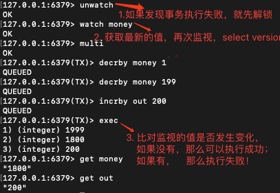

## 6. Jedis

> 什么是Jedis？ 是Redis官方推荐的java连接开发工具！使用Java来操作Redis的中间件！如果你要使用java操作Redis，那么一定要对Jedis十分熟悉！

1. **连接redis**

```java
<!-- https://mvnrepository.com/artifact/redis.clients/jedis -->
<dependency>
    <groupId>redis.clients</groupId>
    <artifactId>jedis</artifactId>
    <version>4.1.1</version>
</dependency>


package com.trove;

import redis.clients.jedis.Jedis;

public class TestPing {
    public static void main(String[] args) {
        //1、 new jedis 对象
        Jedis jedis = new Jedis("127.0.0.1",6379);
        // jedis都是之前指令学习很重要！
        System.out.println(jedis.ping());

    }
}
```

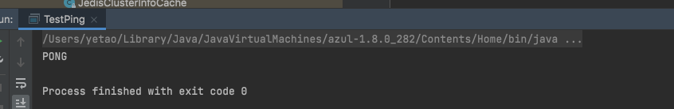


**常用API**

String

List

Set

Hash

Zset


## 7. SpringBoot整合

SpringBoot操作：Spring-data jpa jdbc mongodb redis！

说明：在Springboot 2.x之后，原来的jedis被替换成了lettuce

jedis：采用的是直连的方式，多线程操作的话，是不安全的。如果要避免，就使用Jedis Pool连接池！ **更像BIO模式**

lettuce：采用netty，实例可以再多个线程中共享，不存在线程不安全的情况！可以减少线程数量！ **更像NIO模式**

### 分析源码

**==Springboot所有配置类都有一个自动配置类！！！==**

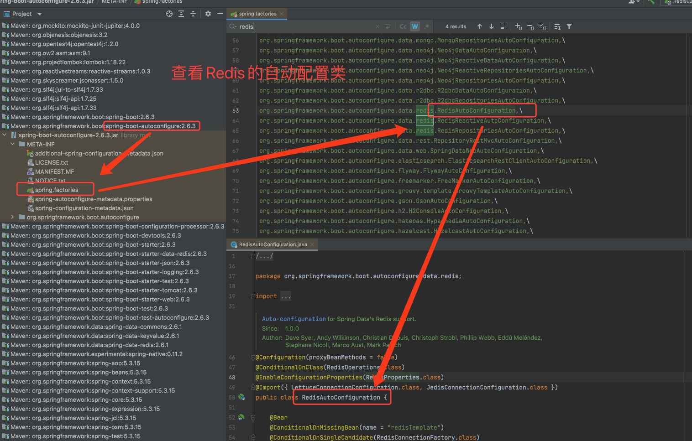


**通过定义一个模版来进行初始化，我们可以自定义模版，同时可以去注解`@EnableConfigurationProperties(RedisPropertis.class)`里去查看配置文件**


**知道`RedisProperties`知道在`application.properties`的配置前缀**

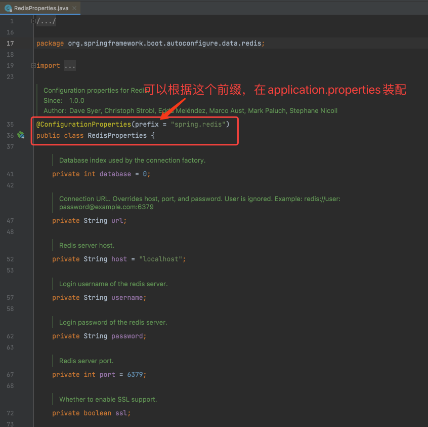

### 使用步骤

#### 1、导入依赖

```xml
<!-- 操作redis -->
<dependency>
  <groupId>org.springframework.boot</groupId>
  <artifactId>spring-boot-starter-data-redis</artifactId>
</dependency>
```

#### 2、配置

```properties
# 配置Redis参数
spring.redis.host=127.0.0.1
spring.redis.port=6379
```

#### 3、使用

```java
package com.beibei;

import org.junit.jupiter.api.Test;
import org.springframework.beans.factory.annotation.Autowired;
import org.springframework.boot.test.context.SpringBootTest;
import org.springframework.data.redis.connection.RedisConnection;
import org.springframework.data.redis.core.RedisTemplate;

@SpringBootTest
class Redis02SpringbootApplicationTests {

    @Autowired
    private RedisTemplate redisTemplate;

    @Test
    void contextLoads() {

        //redisTemplate.opsForValue():操作String
        //redisTemplate.opsForList():操作List
        //redisTemplate.opsForSet():操作Set
        //redisTemplate.opsForHash():操作Hash
        //redisTemplate.opsForZSet():操作ZSet

        //redisTemplate.opsForHyperLogLog():操作yperLogLog
        //redisTemplate.opsForGeo():操作Geo

        redisTemplate.opsForValue().set("Mylove","beibei");
        System.out.println(redisTemplate.opsForValue().get("Mylove"));

        // 操作连接对象
				//RedisConnection connection = redisTemplate.getConnectionFactory().getConnection();
				//connection.flushAll();
				//connection.flushDb();
    }

}
```

### POJO序列化

**当传入的对象没有序列化：**

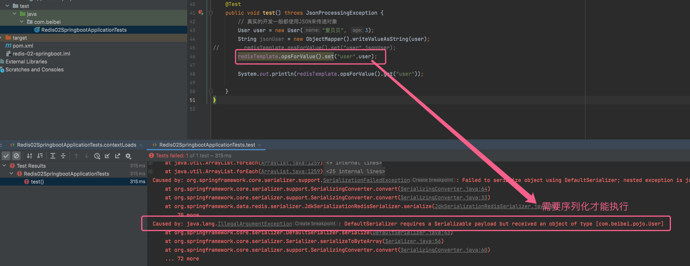

**序列化之后：成功！**

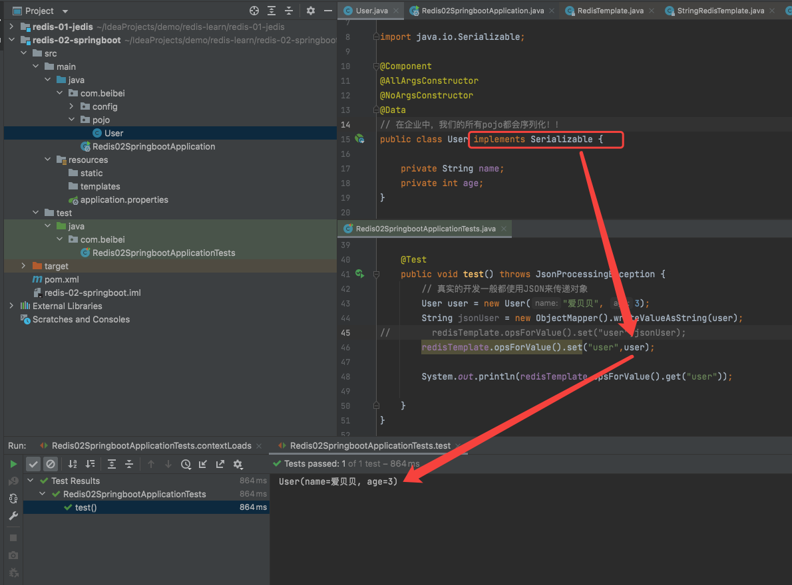

### **测试结果截图**

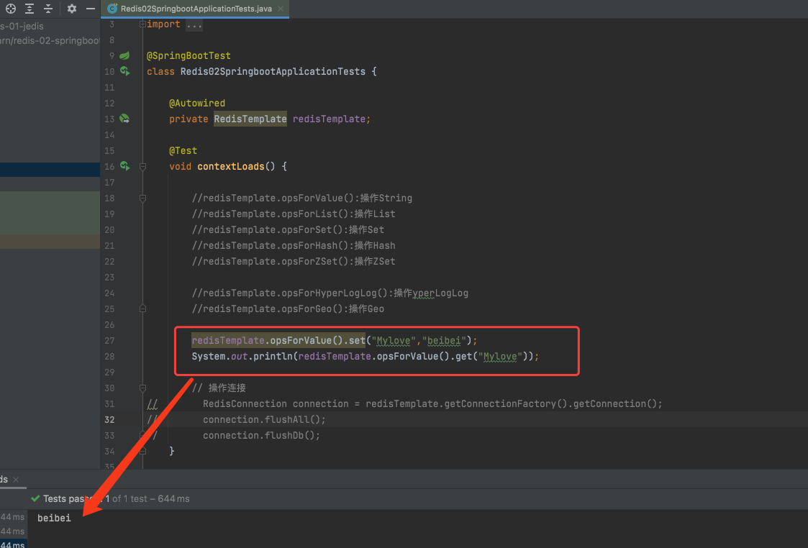

### 自定义RedisTemplate

```java
package com.beibei.config;

import com.fasterxml.jackson.annotation.JsonAutoDetect;
import com.fasterxml.jackson.annotation.PropertyAccessor;
import com.fasterxml.jackson.databind.ObjectMapper;
import org.springframework.context.annotation.Bean;
import org.springframework.context.annotation.Configuration;
import org.springframework.data.redis.connection.RedisConnectionFactory;
import org.springframework.data.redis.core.RedisTemplate;
import org.springframework.data.redis.serializer.Jackson2JsonRedisSerializer;
import org.springframework.data.redis.serializer.StringRedisSerializer;

@Configuration
public class RedisConfig {

    // 编写我们自己的RedisTemplate
    @Bean
    public RedisTemplate<String, Object> redisTemplate(RedisConnectionFactory redisConnectionFactory) {
        // 为了开发方便，一般直接使用<String,Object>
        RedisTemplate<String, Object> template = new RedisTemplate<>();
        template.setConnectionFactory(redisConnectionFactory);

        // 序列化配置
        Jackson2JsonRedisSerializer jackson2JsonRedisSerializer = new Jackson2JsonRedisSerializer(Object.class);
        ObjectMapper om = new ObjectMapper();
        om.setVisibility(PropertyAccessor.ALL, JsonAutoDetect.Visibility.ANY);
        om.enableDefaultTyping(ObjectMapper.DefaultTyping.NON_FINAL);
        jackson2JsonRedisSerializer.setObjectMapper(om);
        //String的序列化
        StringRedisSerializer stringRedisSerializer = new StringRedisSerializer();

        // key采用String的序列化方式
        template.setKeySerializer(stringRedisSerializer);
        // hash的key采用String序列化方式
        template.setHashKeySerializer(stringRedisSerializer);
        // value序列化方式采用jackson
        template.setValueSerializer(jackson2JsonRedisSerializer);
        // hash的value序列化方式采用jackson
        template.setHashValueSerializer(jackson2JsonRedisSerializer);
        template.afterPropertiesSet();

        return template;
    }
}
```

### Set JSON对象

```java
@Test
public void test() throws JsonProcessingException {
    // 真实的开发一般都使用JSON来传递对象
      User user = new User("爱贝贝", 3);
      String jsonUser = new ObjectMapper().writeValueAsString(user);
      redisTemplate.opsForValue().set("user", jsonUser);
  		/*  ######Redis客户端结果######
  		 *	127.0.0.1:6379> get user
			 * 	"\"{\\\"name\\\":\\\"\xe7\x88\xb1\xe8\xb4\x9d\xe8\xb4\x9d\\\",\\\"age\\\":3}\""
  		 */
      System.out.println(redisTemplate.opsForValue().get("user"));
    }

控制台输出：{"name":"爱贝贝","age":3}

@Test
public void test() throws JsonProcessingException {
      User user = new User("爱贝贝", 3);
      redisTemplate.opsForValue().set("user", user);
  		/*  ######Redis客户端结果######
  		 *	127.0.0.1:6379> get user
			 *	"[\"com.beibei.pojo.User\",{\"name\":\"\xe7\x88\xb1\xe8\xb4\x9d\xe8\xb4\x9d\",\"age\":3}]"
  		 */
      System.out.println(redisTemplate.opsForValue().get("user"));
    }

控制台输出：User(name=爱贝贝, age=3)
```

----

> **==值钱的地方开始了==**

## 8. Redis.conf详解

单位配置。忽略大小写

> 网络

```sh
bind 127.0.0.1 # 绑定的ip
protected-mode yes # 保护模式
prot 6379  # 端口设置
```

> 通用

```bash
daemonize yes # 以守护进程的方式运行，默认是no

pidfile /var/run/redis_6379.pid  # 如果以后台的方式运行，需要指定一个pid文件！

# 日志
# Specify the server verbosity level.
# This can be one of:
# debug (a lot of information, useful for development/testing)
# verbose (many rarely useful info, but not a mess like the debug level)
# notice (moderately verbose, what you want in production probably)
# warning (only very important / critical messages are logged)
loglevel notice
logfile ""  # 日志文件位置名
databases 16
always-show-logo no
```

> SNAPSHOTTING快照 

持久化，在规定的时间内，执行多少次操作，则会持久化到文件 .rdb .aof

redis是内存数据库，如果没有持久化，断电即丢失！

```bash
# Unless specified otherwise, by default Redis will save the DB:
#   * After 3600 seconds (an hour) if at least 1 key changed
#   * After 300 seconds (5 minutes) if at least 100 keys changed
#   * After 60 seconds if at least 10000 keys changed
#
# You can set these explicitly by uncommenting the three following lines.

save 3600 1
save 300 100
save 60 10000

stop-writes-on-bgsave-error yes # 持久化如果出错，是否还要继续工作！
rdbcompression yes # 是否压缩rdb文件，需要消耗一定的CPU资源！
rdbchecksum yes # 保存rdb文件的时候，进行错误检查校验！

dir /usr/local/var/db/redis/ # rdb文件保存的目录
```

> REPLICATION 复制  详见主从复制

> CLIENTS 限制

```bash
maxclients 10000
```

> MEMORY MANAGEMENT 内存管理

```bash
maxmemory-policy noeiction #内存达到上限后的处理策略
	1.volatile-lru -> 只对设置了过期时间的key进行LRU（默认）
	2.allkeys-lru -> 删除lru算法的key
	3.volatile-lfu -> Evict using approximated LFU, only keys with an expire set.
	4.allkeys-lfu -> Evict any key using approximated LFU.
	5.volatile-random -> 随机删除即将过期的key
	6.allkeys-random -> 完全随机删除
	7.volatile-ttl -> 删除即将过期
	8.noeviction -> 永不过期，返回错误
```


## 9. Redis持久化

Redis是内存数据库，如果不将内存中的数据库状态保存到磁盘，那么一旦服务器进程退出，服务器中的数据库状态也会消失。所以Redis提供了持久化功能！


### RDB（Redis DataBase）

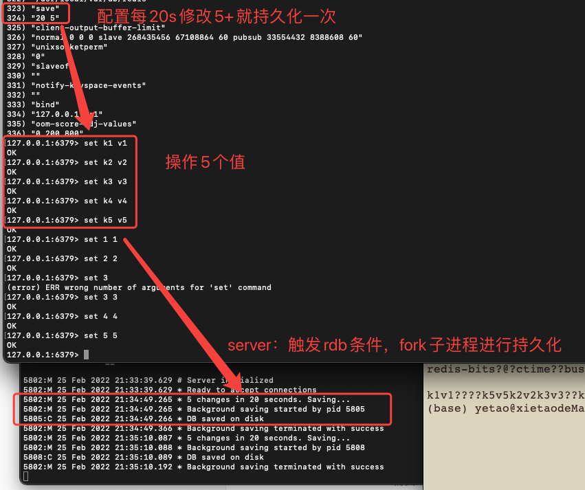

1. save规则满足的情况下，会自动触发rdb规则；
2. 执行flushall命令，也会触发我们的rdb规则！
3. 退出redis，也会产生rdb文件！

==rdb保存的文件是dump.rdb==

> 如何恢复rdb文件？

1. 只需要将rdb文件放在我们redis**启动目录下**就可以，redis启动的时候**会自动检查dump.rdb恢复其中的数据**！
2. 查看启动目录`config get dir`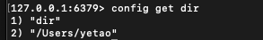

**优点：**

1. **==适合大规模的数据恢复！==**
2. 对数据的**==完整性要求不高==**！

**缺点：**

1. 需要**==一定的时间间隔==**进行操作！如果Redis意外宕机了，**==最后保存后的修改数据就丢失了==**！
2. fork进程的时候会**==占用一定的内存空间==**！


### AOF（Append only file）

将我们的所有命令都记录下来，恢复的时候就把文件全部执行一遍！

**以日志的形式来记录每个写操作，将Redis执行过的所有指令记录下来（读记录不记录）**，**只追加文件不改写文件**，redis启动之初会读取该文件重新构建数据，a.k.a Redis重启就根据日志文件的内容将写指令从前到后执行一次以完成数据的恢复。

`appendonly no`->`appendonly yes`（需要手动去开启）


> **==如果aof文件有错位，redis就无法启动，如何解决？==**

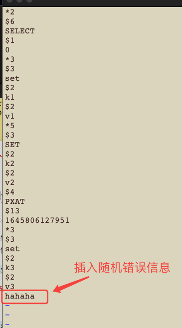

启动Redis会报错

```sh
6518:M 26 Feb 2022 00:25:31.924 # Bad file format reading the append only file: make a backup of your AOF file, then use ./redis-check-aof --fix <filename>
```

执行 `refis-check-aof --fix appendonly.aof`

```sh
(base) yetao@xietaodeMacBook-Pro redis % /usr/local/bin/redis-check-aof --fix appendonly.aof 
0x              8c: Expected prefix '*', got: 'h'
AOF analyzed: size=148, ok_up_to=140, ok_up_to_line=31, diff=8
This will shrink the AOF from 148 bytes, with 8 bytes, to 140 bytes
Continue? [y/N]: y
Successfully truncated AOF
```

再次运行，成功运行！

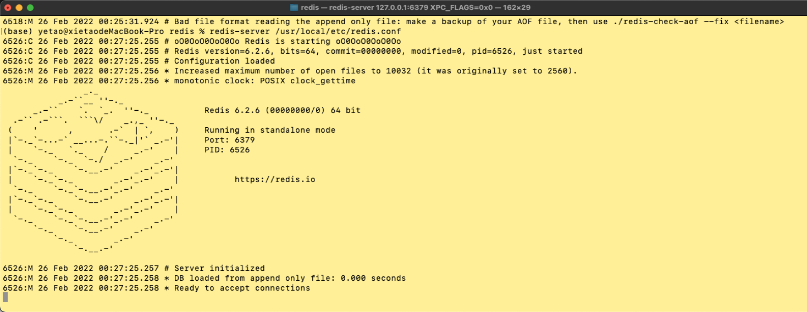

```sh
(base) yetao@xietaodeMacBook-Pro ~ % redis-cli 
127.0.0.1:6379> keys * # 通过aof文件成功写入数据
1) "k3"
2) "k1"
127.0.0.1:6379> get k3
"v3"
127.0.0.1:6379> get k1
"v1"
```


> **==aof文件重写==**

```sh
# 重写触发配置
# (当前AOF文件大小超过上一次重写的AOF文件大小的百分之多少才会重写)
auto-aof-rewrite-percentage 100
# AOF文件重写需要的尺寸，AOF多大时开启重写
auto-aof-rewrite-min-size 64mb

# 文件重写策略
aof-rewrite-incremental-fsync yes
```

> ==**为什么需要重写？**==

因为重写后文件会变小。

1. 进程内**==超时==的数据**不用再写入到AOF文件中。
2. 存在**==删除命令==**。
3. 多条写命令可以**==合并==**为一个

> ==**基本原理图**==


**优点：**

1. **每一次修改都同步，文件的完整性更加好**。==消耗性能==
2. **每秒同步一次**，==可能会丢失一秒的数据。==
3. **从不同步，操作系统来自己同步数据**，==速度最快==！

```bash
6505:M 26 Feb 2022 00:21:56.964 # User requested shutdown...
6505:M 26 Feb 2022 00:21:56.964 * Calling fsync() on the AOF file. # 操作系统同步一般在关闭的时候会进行一次写入
```

**缺点：**

1. 相对于数据文件来说，**==aof远远大于rdb==**，修复速度也比aof慢！
2. **==aof运行效率比rdb慢==**，所以redis==默认的配置就是rdb持久化==！


## 10. Redis发布订阅

Redis发布订阅(pub/sub)是一种消息通信模式：发送者（pub）发送消息，订阅者接收消息。 微信/微博/关注系统！

Redis客户端可以订阅任意数量的频道！


### 订阅发布消息图

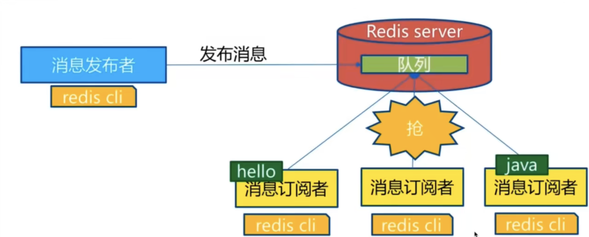


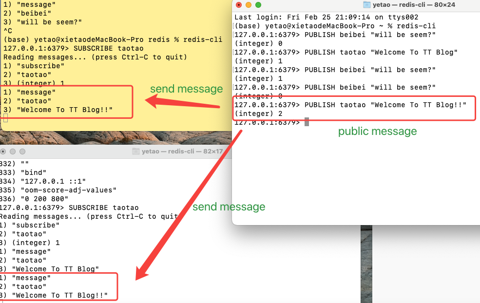


### 命令

```bash
# CLIENT:
127.0.0.1:6379> SUBSCRIBE taotao # 订阅一个频道
Reading messages... (press Ctrl-C to quit)
1) "subscribe"
2) "taotao"
3) (integer) 1

# SERVER:
127.0.0.1:6379> PUBLISH taotao "Welcome To TT Blog!!" # 发布一个信息
(integer) 1

# CLIENT: # 订阅客户端会接收到对应信息
1) "message"
2) "taotao"
3) "Welcome To TT Blog!!"
```


### 原理

Redis-server 维护了一个字典，key为频道，value为一个订阅者链表。

当有动态进行发布的时候，redis-server会找到对应频道key，然后遍历所有客户端链表，将消息发布出去。

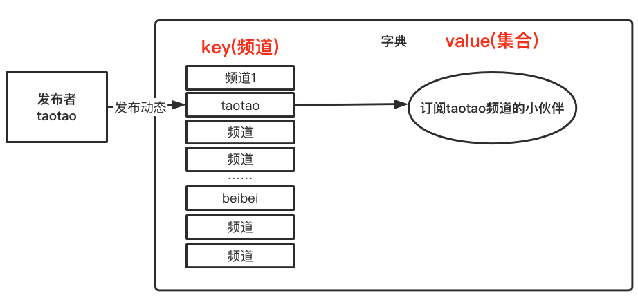

### 使用场景

1. **实时消息系统！**
2. **实时聊天！（频道当作聊天室，发布者接收到订阅者消息再回显给所有人）**
3. **订阅/关注系统！**

**稍微复杂的场景，就用专业的消息中间件MQ！（kafka RabbitMQ）**


## 11. Redis主从复制

### 概念

> 将一台Redis服务器的数据复制到其他的Redis服务器上，前者称之为 主节点（master），后者称之为 从节点（slave）；
>
> 数据的复制是**==单向==**的，只能从主节点到从节点；
>
> **==Master以写为主，Slave以读为主==**

### 主要作用

1. **==数据冗余==**：实现了数据==热备份==，是一种持久化之外的一种**==数据冗余==**方式；
2. **==故障恢复==**：当master出问题，slave可以提供服务，实现故障==快速恢复==；是一种**==服务冗余==**；
3. **==负载均衡==**：在==读多写少==的场景下，master负责写服务，slave负责读服务，可以大大==提高==Redis服务器的并发量；
4. **==高可用基石==**：==哨兵模式和集群==能够实施的基础！


> 单台Redis最大使用内存**==不应该超过20G==**

只要在公司中，**==主从复制==**就是必须要使用的！

### 配置

Redis默认自己是一个master，只要配置slave就可以！

```sh
127.0.0.1:6379> info replication # 查看当前库的信息
# Replication
role:master # 角色 master
connected_slaves:0 # 连接的从机数量
master_failover_state:no-failover
master_replid:f08d87500c8478e02c72040756a5361f3ccadd23
master_replid2:0000000000000000000000000000000000000000
master_repl_offset:0
second_repl_offset:-1
repl_backlog_active:0
repl_backlog_size:1048576
repl_backlog_first_byte_offset:0
repl_backlog_histlen:0
```


1. 复制3个配置文件，分配修改从节点conf配置

```sh
port 6379
pidfile 
logfile "6379.log"
dbfilename dump6379.rdb
```

2. 启动server

   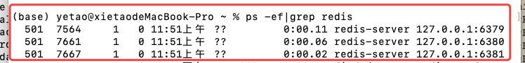

3. **==一主二从==**

   默认情况下，每台Redis服务器都是主节点；一般情况下只配置从机就好了！

   **6380从机**

   ```sh
   127.0.0.1:6380> slaveof 127.0.0.1 6379 # 配置从机 认老大！！！
   OK
   127.0.0.1:6380> info replication
   # Replication
   role:slave
   master_host:127.0.0.1
   master_port:6379
   master_link_status:up
   master_last_io_seconds_ago:2
   master_sync_in_progress:0
   slave_read_repl_offset:0
   slave_repl_offset:0
   slave_priority:100
   slave_read_only:1
   replica_announced:1
   connected_slaves:0
   master_failover_state:no-failover
   master_replid:1c1998d2fb99ef1a0c6f62498be68290f48e17de
   master_replid2:0000000000000000000000000000000000000000
   master_repl_offset:0
   second_repl_offset:-1
   repl_backlog_active:1
   repl_backlog_size:1048576
   repl_backlog_first_byte_offset:1
   repl_backlog_histlen:0
   ```

   **6379主机**

   ```sh
   127.0.0.1:6379> info replication
   # Replication
   role:master
   connected_slaves:1 # 多了从机的配置
   slave0:ip=127.0.0.1,port=6380,state=online,offset=28,lag=0
   master_failover_state:no-failover
   master_replid:1c1998d2fb99ef1a0c6f62498be68290f48e17de
   master_replid2:0000000000000000000000000000000000000000
   master_repl_offset:28
   second_repl_offset:-1
   repl_backlog_active:1
   repl_backlog_size:1048576
   repl_backlog_first_byte_offset:1
   repl_backlog_histlen:28
   ```

   **再次加入6381从机**

   ```sh
   127.0.0.1:6381> SLAVEOF 127.0.0.1 6379
   OK
   127.0.0.1:6381> info replication
   # Replication
   role:slave
   master_host:127.0.0.1
   master_port:6379
   master_link_status:up
   master_last_io_seconds_ago:2
   master_sync_in_progress:0
   slave_read_repl_offset:168
   slave_repl_offset:168
   slave_priority:100
   slave_read_only:1
   replica_announced:1
   connected_slaves:0
   master_failover_state:no-failover
   master_replid:1c1998d2fb99ef1a0c6f62498be68290f48e17de
   master_replid2:0000000000000000000000000000000000000000
   master_repl_offset:168
   second_repl_offset:-1
   repl_backlog_active:1
   repl_backlog_size:1048576
   repl_backlog_first_byte_offset:169
   repl_backlog_histlen:0
   ```

   **6379**

   ```sh
   127.0.0.1:6379> info replication
   # Replication
   role:master
   connected_slaves:2 # 现在有2台了
   slave0:ip=127.0.0.1,port=6380,state=online,offset=182,lag=1
   slave1:ip=127.0.0.1,port=6381,state=online,offset=182,lag=1
   master_failover_state:no-failover
   master_replid:1c1998d2fb99ef1a0c6f62498be68290f48e17de
   master_replid2:0000000000000000000000000000000000000000
   master_repl_offset:182
   second_repl_offset:-1
   repl_backlog_active:1
   repl_backlog_size:1048576
   repl_backlog_first_byte_offset:1
   repl_backlog_histlen:182
   ```

   真实的只配置在配置文件中配置，是永久的！`replicaof <masterip> <masterport>`

   

> 细节


**==主机可以写，从机只能读！==**

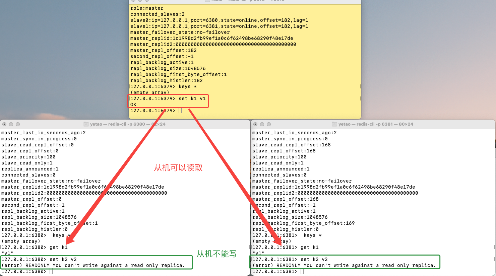

> **==主机宕机==，从机依旧连接到主机，但是没有写操作服务了。如果主机回来了，从机依旧可以直接获取主机写信息！**

> **==从机宕机==，如果是命令行配置的，连回来自动变回master，配置好slaveof后，马上就同步master信息，可以获取到所有的keys。**

### 复制原理

**Slave启动成功连接到master后会发送一个sync同步命令**

**Master接收到命令后，启动后台的存盘进程，同时收集所有接收到的用于修改数据集命令，在后台进程执行完毕之后，master将传送整个数据文件到slave，并完成一次全量同步；**

- ==全量复制==：Slave服务接收到数据文件后，存盘并加载到内存中；
- ==增量复制==：Master继续将新的所有收集到的修改命令一次传给Slave，完成增量同步

但是只要重新**==连接一次master，全量复制就会被执行一次！==**


### 层层链路（工作中不会使用）

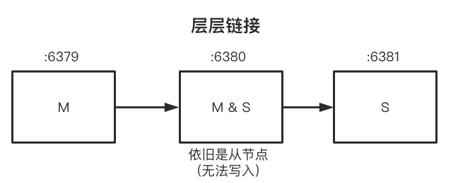

> 如果老大没了，6379宕机了，我们得选个新老大？

**==谋权篡位：==**手动命令`slaveof no one`把自己变成master


### 哨兵模式(工作中使用，高频⚠️)

（自动选举老大的模式）

#### 配置

**需要配置多个哨兵进程（==哨兵集群==）！用来监控Redis服务器是否存活！以及互相监控哨兵的可用性！**


#### 原理

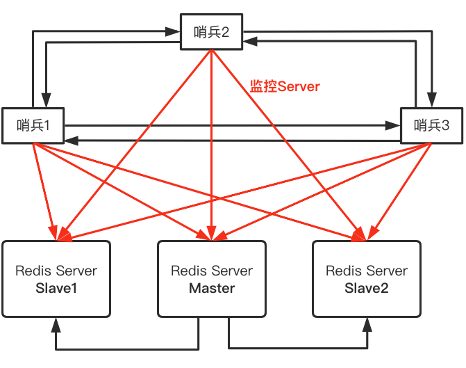

1. **==主观下线==**：**单个 Sentinel 实例对服务器做出的下线判断**；假设Master宕机，哨兵1检测到结果后，会主观认为Master不可用

2. **==客观下线==**：**（只适用于主服务器）多个Sentinel实例对同一个服务器做出下线判断**；通过命令 `is-master-down-by-addr `进行交流，当后面的哨兵也检测到master不可用，并且达到一定的数量

3. **==故障迁移Failover==**：如果有一个Sentinel发现某个主服务器进入到客观下线状态，就会被推选出来对失效的Master**执行自动的故障迁移Failover操作**。

#### 测试

> 目前的状态是一主二从

1. 配置哨兵配置文件 sentinel.conf

   ```sh
   # sentinel monitor 被监控的名称 host port 1
   entinel monitor myredis 127.0.0.1 6379 1
   ```

   后面的数字1，代表当主机挂了，slave投票让谁接替主机，票数最多就会成为主机！

2. 启动哨兵

   ```sh
   (base) yetao@xietaodeMacBook-Pro ~ % redis-sentinel /usr/local/etc/sentinel.conf # 启动哨兵命令
   7970:X 26 Feb 2022 13:21:15.030 # oO0OoO0OoO0Oo Redis is starting oO0OoO0OoO0Oo
   7970:X 26 Feb 2022 13:21:15.030 # Redis version=6.2.6, bits=64, commit=00000000, modified=0, pid=7970, just started
   7970:X 26 Feb 2022 13:21:15.030 # Configuration loaded
   7970:X 26 Feb 2022 13:21:15.031 * Increased maximum number of open files to 10032 (it was originally set to 2560).
   7970:X 26 Feb 2022 13:21:15.031 * monotonic clock: POSIX clock_gettime
                   _._                                                  
              _.-``__ ''-._                                             
         _.-``    `.  `_.  ''-._           Redis 6.2.6 (00000000/0) 64 bit
     .-`` .-```.  ```\/    _.,_ ''-._                                  
    (    '      ,       .-`  | `,    )     Running in sentinel mode # 以哨兵模式运行
    |`-._`-...-` __...-.``-._|'` _.-'|     Port: 26379
    |    `-._   `._    /     _.-'    |     PID: 7970
     `-._    `-._  `-./  _.-'    _.-'                                   
    |`-._`-._    `-.__.-'    _.-'_.-'|                                  
    |    `-._`-._        _.-'_.-'    |           https://redis.io       
     `-._    `-._`-.__.-'_.-'    _.-'                                   
    |`-._`-._    `-.__.-'    _.-'_.-'|                                  
    |    `-._`-._        _.-'_.-'    |                                  
     `-._    `-._`-.__.-'_.-'    _.-'                                   
         `-._    `-.__.-'    _.-'                                       
             `-._        _.-'                                           
                 `-.__.-'                                               
   
   7970:X 26 Feb 2022 13:21:15.034 # Sentinel ID is 84b0e769b42f381c50011256886a8425da7ec16b
   7970:X 26 Feb 2022 13:21:15.034 # +monitor master myredis 127.0.0.1 6379 quorum 1 # 监控信息
   7970:X 26 Feb 2022 13:21:15.036 * +slave slave 127.0.0.1:6381 127.0.0.1 6381 @ myredis 127.0.0.1 6379 # 从机信息
   7970:X 26 Feb 2022 13:21:15.036 * +slave slave 127.0.0.1:6380 127.0.0.1 6380 @ myredis 127.0.0.1 6379 # 从机信息
   ```

   **测试Master挂了，哨兵会开始进行监控->提醒->自动故障迁移**

   ```sh
   7970:X 26 Feb 2022 13:25:00.758 # +sdown master myredis 127.0.0.1 6379                  # 主观下线
   7970:X 26 Feb 2022 13:25:00.758 # +odown master myredis 127.0.0.1 6379 #quorum 1/1      # 客观下线
   7970:X 26 Feb 2022 13:25:00.758 # +new-epoch 1
   7970:X 26 Feb 2022 13:25:00.758 # +try-failover master myredis 127.0.0.1 6379
   7970:X 26 Feb 2022 13:25:00.760 # +vote-for-leader 84b0e769b42f381c50011256886a8425da7ec16b 1
   7970:X 26 Feb 2022 13:25:00.760 # +elected-leader master myredis 127.0.0.1 6379
   7970:X 26 Feb 2022 13:25:00.760 # +failover-state-select-slave master myredis 127.0.0.1 6379
   7970:X 26 Feb 2022 13:25:00.827 # +selected-slave slave 127.0.0.1:6381 127.0.0.1 6381 @ myredis 127.0.0.1 6379
   7970:X 26 Feb 2022 13:25:00.827 * +failover-state-send-slaveof-noone slave 127.0.0.1:6381 127.0.0.1 6381 @ myredis 127.0.0.1 6379
   7970:X 26 Feb 2022 13:25:00.890 * +failover-state-wait-promotion slave 127.0.0.1:6381 127.0.0.1 6381 @ myredis 127.0.0.1 6379
   7970:X 26 Feb 2022 13:25:01.710 # +promoted-slave slave 127.0.0.1:6381 127.0.0.1 6381 @ myredis 127.0.0.1 6379
   7970:X 26 Feb 2022 13:25:01.710 # +failover-state-reconf-slaves master myredis 127.0.0.1 6379
   7970:X 26 Feb 2022 13:25:01.801 * +slave-reconf-sent slave 127.0.0.1:6380 127.0.0.1 6380 @ myredis 127.0.0.1 6379
   7970:X 26 Feb 2022 13:25:02.712 * +slave-reconf-inprog slave 127.0.0.1:6380 127.0.0.1 6380 @ myredis 127.0.0.1 6379
   7970:X 26 Feb 2022 13:25:02.712 * +slave-reconf-done slave 127.0.0.1:6380 127.0.0.1 6380 @ myredis 127.0.0.1 6379
   7970:X 26 Feb 2022 13:25:02.806 # +failover-end master myredis 127.0.0.1 6379
   7970:X 26 Feb 2022 13:25:02.807 # +switch-master myredis 127.0.0.1 6379 127.0.0.1 6381     # 新的master由原来:6381从节点选举成
   ```

   **当原来Master机器回来了，只能当slave （当小弟）**

#### 优缺点

**==优点：==**

1. 哨兵集群，基于主从复制模式，所有主从配置优点都有
2. 主从可以切换，鼓掌可以转移，可用性更好！
3. 哨兵模式就是主从模式的升级，手动到自动化！

**==缺点：==**

1. Redis不好在线扩容，在线扩容很麻烦！
2. 实现哨兵模式的配置很麻烦，里面有很多选择


#### 全部配置

```sh
port 26379 # 集群需要改端口
dir /tmp
sentinel monitro mymaster 127.0.0.1 6379 2
sentinel down-after-milliseconds mymaster 30000 # 30s
sentinel failover-timeout mymaster 180000 # 180s 3min
sentinel notification-script mymaster /var/redis/notify.sh # 通知脚本
sentinel client-reconfig-script mymaster /var/redis/reconfig.sh # 重新配置主节点参数脚本，一般都是由运维来配置的！
```

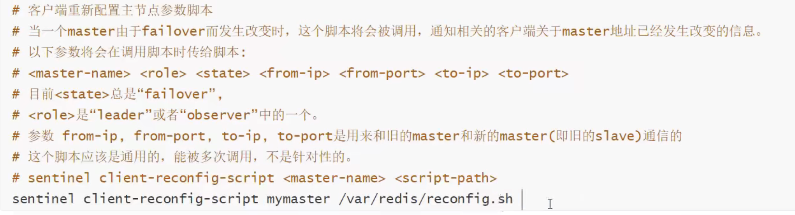


