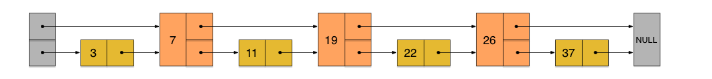

# Redis—Zset原理

## 本章内容

**主要描述楼主学习Zset的原理过程，不涉及过多源码，旨在理解原理，点到为止。**

> **主要参考资料：[CSDN-redis zset 内部的实现原理](https://blog.csdn.net/weixin_38008100/article/details/94629753)** 
>
> **Zset基本内容参考我的Redis基础的文章：[Redis基础](./redis.md/#Zset(sorted sets)有序集合)**

----

## 数据结构介绍

**zset有序集合有两种存储结构：压缩链表（ziplist） 或 跳表（skiplist）。**

> **使用ziplist的条件**

- 元素数量小于128($2^7$)个 
- 所有member的长度都小于64字节

以上条件可以通过配置文件修改：***zset-max-ziplist-entries***和***zset-max-ziplist-value***。

---

### ziplist

一个链表，两两为一组，第一个节点保存member，第二个保存score。然后按照从小到大排序。

### skiplist

底层是一个命名为zset的结构体，zset结构里面包含一个字典和一个跳跃表。

- **跳跃表**按照score从小到大保存所有集合。

- **字段**保存从member-->score的映射。

- 使用**O(1)的复杂度**在链表中**查找**对应member的score。

> **先了解一下原始的跳表**

#### 原始跳表skiplist

是一种**可以二分查找的有序链表**，在原基础上增加了**多级索引**。相比于链表O(n)的查找效率，它的CRUD平均期望都是O(logN)，比肩红黑树。

**性质**

(1) 由很多层结构组成，**level是通过一定的概率随机产生的**；
(2) 每一层都是一个有序的链表，默认是升序 ；
(3) 最底层(Level 1)的链表包含所有元素；
(4) 如果一个元素出现在Level i 的链表中，则它在Level i 之下的链表也都会出现； 
(5) **每个节点包含两个指针，一个指向同一链表中的下一个元素，一个指向下面一层的元素。**

**操作时间复杂度**

| 操作 | 时间复杂度 |
| ---- | ---------- |
| 插入 | O(log N)   |
| 删除 | O(log N)   |
| 查询 | O(log N)   |

**skiplist vs RB-Tree**

| 操作     | Skiplist                                             | RB-Tree                              |
| -------- | ---------------------------------------------------- | ------------------------------------ |
| 区间查询 | 直接找到最小值，遍历第一层即可O(logN)                | 不仅要查最小值，还要中序遍历查最大值 |
| 空间     | **浪费空间**（采用空间换时间的策略）             | **没有额外空间**                 |
| 实现难度 | 简单                                                 | 复杂                                 |
| 稳定性   | 存在概率恶化（比如上层表元素过多，退化成了普通链表） | 稳定                                 |
| 插入     | 只需要将处理插入元素的前后指针即可                   | 需要考虑树的平衡，进行旋转           |

**简述操作过程**

- **插入**

  

- **查找**

