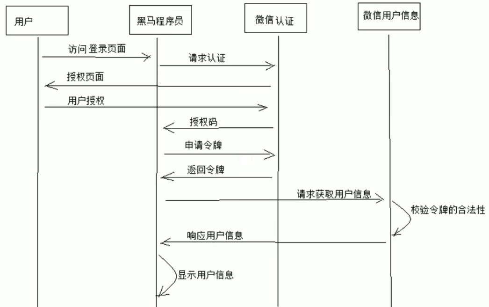
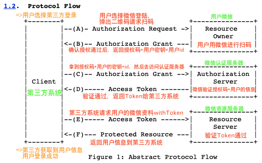

# Spring-Security

 **OAuth2.0认证授权**——**针对分布式系统**
- [Spring-Security](#spring-security)
  - [OAuth2.0](#oauth20)
    - [1. 介绍](#1-介绍)
    - [2. Spring Cloud Security OAuth2](#2-spring-cloud-security-oauth2)
      - [环境介绍](#环境介绍)
    - [3. JWT令牌](#3-jwt令牌)
      - [1. 介绍](#1-介绍-1)

## OAuth2.0

### 1. 介绍

​	OAuth是一个开放标准，**允许用户授权第三方应用访问他们存储在另外的服务提供者上的信息**，**而不需要提供用户名和密码给第三方**应用或分享他们数据的所有内容。

**[白皮书The OAuth 2.0 Authorization Framework](https://datatracker.ietf.org/doc/html/rfc6749)**

**OAuth2.0流程**

### 2. Spring Cloud Security OAuth2

####   环境介绍

​		OAuth2.0的服务提供方涵盖了2个服务：**授权服务(Authorization Server, a.k.a. 认证服务)**和**资源服务(Resource Server)**。

- **授权服务**：包含对接入端以及登入用户的合法性进行验证并颁发Token等功能，对令牌的请求端点由SpringMVC控制器进行实现，下面是配置一个认证服务必须要实现的endpoints：
  - **AuthorizationEndpoint**服务于认证请求。默认URL：`/oauth/authorize`.
  - **TokenEndpoint**服务于访问令牌的请求。默认URL：`/oauth/token`.
- **资源服务**：应包含对资源的保护功能，对非法请求进行拦截，对请求中的token进行解析鉴权等，下面的过滤器用于实现OAuth2.0资源服务
  - **OAuth2AuthenicationProcessingFilter**用来对请求给出的身份令牌解析鉴权.

**架构：**UAA授权服务（认证Client+颁发token）+Order资源服务（校验token+返回资源）

### 3. JWT令牌

#### 1. 介绍

​		主要解决的事当资源服务和授权服务不在一起时，资源服务使用RemoteTokenServices远程请求授权服务验证token，当系统访问量大的时候会影响系统的性能。

**解决办法**：令牌采用JWT格式，用户认证后会得到JWT令牌，**令牌中包含了用户相关信息**，客户端只需要携带JWT令牌访问资源服务，资源服务会**根据事先约定好的算法自行检查令牌**而不去请求认证服务授权。

