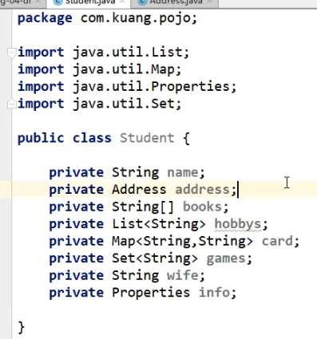
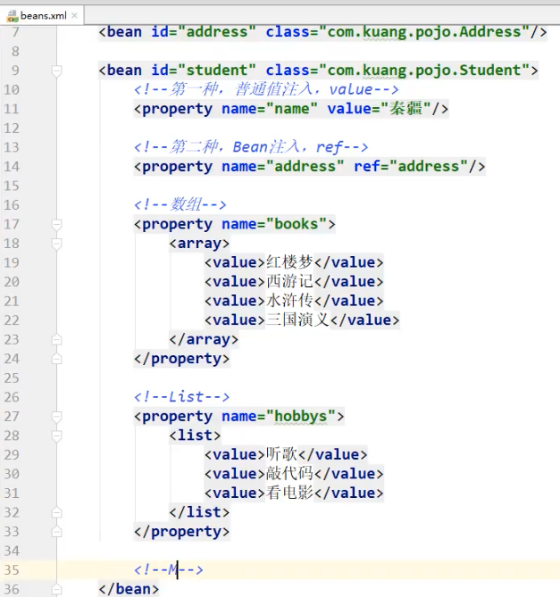
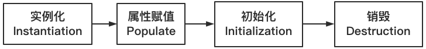
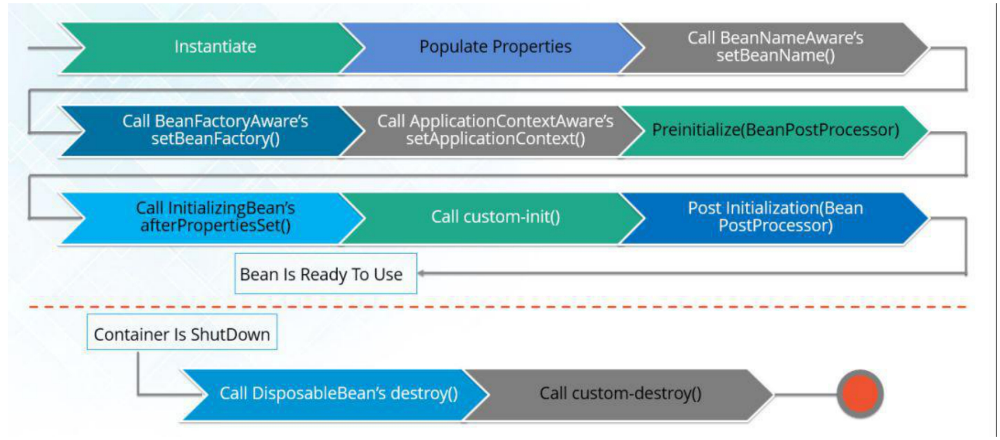

# Spring
- [Spring](#spring)
- [1. IOC容器](#1-ioc容器)
  - [1.1. What Is IOC？](#11-what-is-ioc)
  - [1.2.WHY IOC？](#12why-ioc)
  - [1.3. IOC创建对象的方式](#13-ioc创建对象的方式)
  - [1.4. Spring配置](#14-spring配置)
  - [1.5. 依赖注入](#15-依赖注入)
    - [1.5.1 构造器注入【常用】](#151-构造器注入常用)
    - [1.5.2 Setter方式注入【重点】](#152-setter方式注入重点)
    - [1.5.3 拓展方式注入【少用】](#153-拓展方式注入少用)
    - [1.5.4 What is Bean？](#154-what-is-bean)
    - [1.5.5 Bean作用域](#155-bean作用域)
    - [1.5.6 singleton作用域(单例模式)](#156-singleton作用域单例模式)
    - [1.5.7 Bean生命周期](#157-bean生命周期)
    - [1.5.8 Bean后置处理器](#158-bean后置处理器)
  - [1.6 Bean自动装配](#16-bean自动装配)
    - [**1.6.1 在xml中配置**](#161-在xml中配置)
    - [1.6.2 **在java中配置(替代XML配置)**](#162-在java中配置替代xml配置)
    - [1.6.3 隐式的自动装配bean【重要】](#163-隐式的自动装配bean重要)
  - [1.7 Spring有多少种容器](#17-spring有多少种容器)
    - [BeanFactory容器](#beanfactory容器)
    - [ApplicationContext容器(extend BeanFactory)](#applicationcontext容器extend-beanfactory)
# 1. IOC容器

## 1.1. What Is IOC？

**IoC(Inversion of Control)是一种设计思想，DI只是实现IoC的一种方法。**

**控制反转**：是一种通过描述(XML或注解)并通过第三方去生产或获取特定对象的方式。

## 1.2.WHY IOC？

**解耦**

## 1.3. IOC创建对象的方式

1. 使用无参构造创建对象，默认！

2. 使用有参构造创建对象

   1. 下标赋值

      ```xml
      <bean id="user" class="com.yt.pojo.User">
      		<constructor-arg index="0" value="beibei"/>
      </bean>
      ```

   2. 通过类型创建，不推荐使用

      ```xml
      <bean id="user" class="com.yt.pojo.User">
      		<constructor-arg type="java.lang.String" value="beibei"/>
      </bean>
      ```

   3. 直接通过参数名,**推荐👍**

      ```xml
      <bean id="user" class="com.yt.pojo.User">
      		<constructor-arg name="name" value="beibei"/>
      </bean>
      ```

   **总结：在配置文件加载的时候，容器中管理的对象就已经初始化了！**

## 1.4. Spring配置

```xml
<!--
	id：Bean的唯一标识符
	class：bean的全限定名：包名+类名
	name：别名，同时多个
-->
<bean id="user" class="com.yt.pojo.User" name="u1,u2">
		<constructor-arg name="name" value="beibei"/>
</bean>
<!-- 用于团队开发，可以将多个配置文件，import导入合并为一个，使用总的配置applicationContext.xml即可 -->
<import resource="bean.xml"/>
<import resource="bean1.xml"/>
<import resource="bean2.xml"/>
```

## 1.5. 依赖注入

### 1.5.1 构造器注入【常用】

### 1.5.2 Setter方式注入【重点】

- 依赖注入：Setter注入
  - 依赖：bean对象的创建依赖于容器
  - 注入：bean对象中的所有属性，由容器来注入

【环境搭建】

**复杂类型**

**真实测试对象**

### 1.5.3 拓展方式注入【少用】

**p命名空间和c命名空间**

不能直接使用，需要导入xml约束！

```xml
<beans xmlns:p="http://www.springframework.org/schema/p"
       xmlns:p="http://www.springframework.org/schema/p">
  <!-- p命名空间注入：可以直接注入属性的值：property -->
  <bean id="user" class="com.yt.pojo.User" p:name="beibei" p:age="18"></bean>

  <!-- c命名空间注入：通过构造器注入，construct-args -->
  <bean id="user2" class="com.yt.pojo.User" c:name="beibei" c:age="18"></bean>
</beans>
```

### 1.5.4 What is Bean？

**bean 是由 Spring IoC 容器实例化、组装和管理的对象。**

### 1.5.5 Bean作用域

| 作用域            | 描述                                                         |
| ----------------- | ------------------------------------------------------------ |
| **singleton** | 在spring IoC容器**仅存在一个**Bean实例，Bean以单例方式存在，默认值 |
| **prototype** | **每次请求都会创建一个新的 bean 实例。**                 |
| request           | 每一次 HTTP 请求都会产生一个新的 bean，该 bean 仅在当前 HTTP request 内有效。 |
| session           | 每一次 HTTP 请求都会产生一个新的 bean，该 bean 仅在当前 HTTP session 内有效。 |

### 1.5.6 singleton作用域(单例模式)

> Singleton 是单例类型，就是在**创建起容器时就同时自动创建了一个 bean 的对象**，不管你是否使用，他都存在了，每次获取到的对象都是同一个对象。注意，**Singleton 是默认作用域**；

```xml
<!-- A bean definition with singleton scope -->
<bean id="..." class="..." scope="singleton">
    <!-- collaborators and configuration for this bean go here -->
</bean>
```

### 1.5.7 Bean生命周期

> TODO：https://blog.csdn.net/riemann_/article/details/118500805



```java
protected Object doCreateBean(String beanName, RootBeanDefinition mbd, @Nullable Object[] args) throws BeanCreationException {
    BeanWrapper instanceWrapper = null;
    if (mbd.isSingleton()) {
        instanceWrapper = (BeanWrapper)this.factoryBeanInstanceCache.remove(beanName);
    }

    if (instanceWrapper  null) {
    	// 实例化阶段
        instanceWrapper = this.createBeanInstance(beanName, mbd, args);
    }

    ...

    Object exposedObject = bean;

    try {
    	// 属性赋值阶段
        this.populateBean(beanName, mbd, instanceWrapper);
        // 初始化阶段
        exposedObject = this.initializeBean(beanName, exposedObject, mbd);
    } catch (Throwable var18) {
        ...
    }

    ...
}
```

**详细Bean声明周期图示**

### 1.5.8 Bean后置处理器

> **在调用初始化方法前后对Bean进行额外的处理，实现BeanPostProcessor接口**

```java
postProcessBeforeInitialization(Object, String)
postProcessAfterInitialization(Object, String)
```

## 1.6 Bean自动装配

- 自动装配是Spring满足bean依赖的一种方式
- Spring会在上下文中自动寻找，并自动给bean装配属性！


在Spring种**三种装配方式**

### **1.6.1 在xml中配置**

**spring.xml**

```xml
<beans xmlns="http://www.springframework.org/schema/beans"
       xmlns:xsi="http://www.w3.org/2001/XMLSchema-instance"
       xsi:schemaLocation="http://www.springframework.org/schema/beans
        https://www.springframework.org/schema/beans/spring-beans.xsd">

    <!-- 1.byName自动装配 -->
    <bean id="dog" class="com.yt.Dog"/>
    <bean id="cat" class="com.yt.Cat"/>
    <bean id="people" class="com.yt.People" autowire="byName">
        <property name="name" value="hanghang"/>
    </bean>

    <!-- 2. byType自动装配-->
    <bean class="com.yt.Dog"/>
    <bean class="com.yt.Cat"/>
    <bean id="people" class="com.yt.People" autowire="byType">
        <property name="name" value="hanghang"/>
    </bean>
</beans>
```

**总结：**

- **byName**的时候，要**保证id唯一**，并且bean需要和自动注入的属性的**set方法的值一致**！
- **byType**的时候，需要保证所有bean的**class唯一**，并且这个bean需要和自动注入的**属性的类型一致**！

### 1.6.2 **在java中配置(替代XML配置)**

@Bean和`@Configurationspring.xml`声明当前类是一个**配置类**

### 1.6.3 隐式的自动装配bean【重要】

jdk1.5支持注解，spring2.5支持注解。

要使用注解⚠️：

1. **导入约束：context约束；**

   ```xml
   xmlns:context="http://www.springframework.org/schema/context"
   xsi:schemaLocation="
           http://www.springframework.org/schema/context
           https://www.springframework.org/schema/context/spring-context.xsd"
   ```

   

2. **配置注解的支持**：`<context:annotation-config/>`

**spring.xml**

```xml
<beans xmlns="http://www.springframework.org/schema/beans"
       xmlns:xsi="http://www.w3.org/2001/XMLSchema-instance"
       xmlns:context="http://www.springframework.org/schema/context"
       xsi:schemaLocation="http://www.springframework.org/schema/beans
        https://www.springframework.org/schema/beans/spring-beans.xsd
        http://www.springframework.org/schema/context
        https://www.springframework.org/schema/context/spring-context.xsd">
  
    <!-- 开启注解支持 -->
    <context:annotation-config/>

    <bean id="cat" class="com.yt.Cat"/>
    <bean id="dog" class="com.yt.Dog"/>
    <bean id="people" class="com.yt.People"/>
</beans>
```

**People.java(不需要setter方法)**

```java
package com.yt;

import org.springframework.beans.factory.annotation.Autowired;

public class People {

    @Autowired(required = false)
    private Cat cat;
    @Autowired
    @Qualifier(value="dog222") //当自动装配环境复杂时，无法通过@Autowired完成，就可以配合使用并指定唯一bean对象. 相当于去匹配一个bean id
    private Dog dog;
    private String name;

    public Cat getCat() {
        return cat;
    }

    public Dog getDog() {
        return dog;
    }

    public String getName() {
        return name;
    }

    public void setName(String name) {
        this.name = name;
    }
}
```

**小结：**

**区别**

| **@Resource**                                    | @Autowired                                        |
| ------------------------------------------------ | ------------------------------------------------- |
| 都是**自动装配**，都可以**放在属性字段上**       | 都是**自动装配**，都可以**放在属性字段上**        |
| **默认byName方式->byType方式->报错【常用】** | **byType方式 而且必须要求对象存在！【常用】** |


## 1.7 Spring有多少种容器

### BeanFactory容器

将所有对象的创建交给一个工厂类类管理

### ApplicationContext容器(extend BeanFactory)

Spring容器以前通过BeanFacotry容器，如今**通过ApplicationContext容器**来实现.

**个人理解：通过spring.xml配置文件定义好映射POJO类的Bean并定义好初始化参数，剩下的交给IOC容器统一管理。例子：将你的控制权交给别人，告诉他这个东西怎么用就好了**

**区别**

| BeanFactory                | ApplicationContext       |
| -------------------------- | ------------------------ |
| 它使用懒加载               | 它使用即时加载           |
| 它使用语法显式提供资源对象 | 它自己创建和管理资源对象 |
| 不支持国际化               | 支持国际化               |
| 不支持基于依赖的注解       | 支持基于依赖的注解       |


**POJO类**

```java
package com.trove.spring;

public class HelloWorld {
    private String message;
    public void setMessage(String message){
        this.message  = message;
    }
    public void getMessage(){
        System.out.println("Your Message : " + message);
    }
}
```

**spring.xml配置**

```xml
<?xml version="1.0" encoding="UTF-8"?>
<beans xmlns="http://www.springframework.org/schema/beans"
       xmlns:xsi="http://www.w3.org/2001/XMLSchema-instance"
       xsi:schemaLocation="http://www.springframework.org/schema/beans
    http://www.springframework.org/schema/beans/spring-beans-3.0.xsd">

    <bean id="helloWorld" class="com.trove.spring.HelloWorld">
        <property name="message" value="Hello World!"/>
    </bean>

</beans>
```

**Main执行类**

```java
package com.trove.spring;

import org.springframework.context.ApplicationContext;
import org.springframework.context.support.FileSystemXmlApplicationContext;

/**
 * Hello world!
 */
public class App {
    public static void main(String[] args) {

        ApplicationContext context = new ClassPathXmlApplicationContext("spring.xml");
        HelloWorld obj = (HelloWorld)context.getBean("helloWorld");
        obj.getMessage();
    }
}
```

**输出结果：**

```shell
Your Message : Hello World!
```

